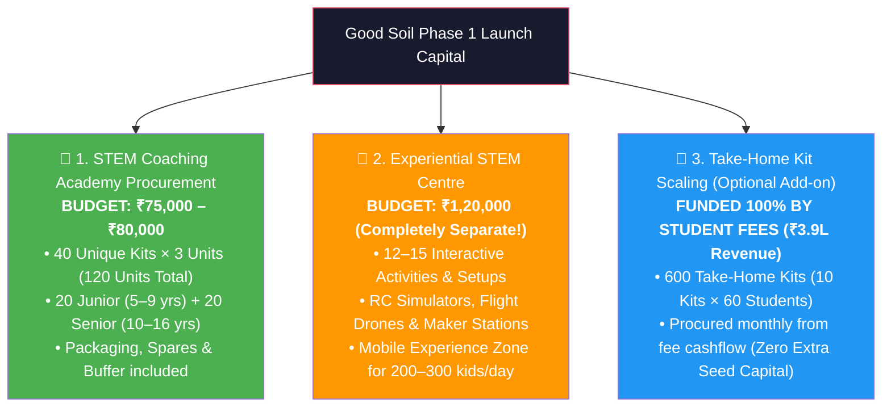

# Good Soil — Phase 1 Kit Procurement Bill of Materials (BOM) & Budget Sheet

> **Document Version:** 1.0  
> **Target Program:** 6-Month STEM Pilot (60 Students: 30 Junior + 30 Senior)  
> **Master Excel Workbook:** [`Budget/GoodSoil_Phase1_Kit_Procurement_BOM.xlsx`](file:///c:/Users/vizzu/Desktop/Good%20Soil/Budget/GoodSoil_Phase1_Kit_Procurement_BOM.xlsx)  
> **Kit Database Reference:** [`Vendor Research/GoodSoil_Kit_Catalogue.xlsx`](file:///c:/Users/vizzu/Desktop/Good%20Soil/Vendor%20Research/GoodSoil_Kit_Catalogue.xlsx)

---

## 1. Executive Budget Architecture (Two Independent Budgets)

### Clean Budget Breakdown Matrix

| Budget Parameter | Coaching Academy In-Class Sets *(Seed Outlay)* | Experiential STEM Centre *(Separate Budget)* | Student Take-Home Scaling *(Self-Funded)* |
| :--- | :--- | :--- | :--- |
| **Allocated Budget** | **₹75,000 – ₹80,000** | **₹1,20,000** | **₹0 Upfront** *(Funded via Tuition)* |
| **Target Audience** | 60 Enrolled Students (30 Jr + 30 Sr) | 200–300 Walk-in Students / Day | 60 Enrolled Students (10 Take-Homes each) |
| **Unit Scope** | **120 Kit Units** (40 Designs × 3 Units) | **12–15 Mobile Interactive Stations** | **600 Take-Home Units** |
| **Junior Component** | **₹31,380** *(20 kits × 3 @ avg ₹400)* | Included in ₹1.2L Allocation | **₹1,32,240** *(30 kids × 10 kits)* |
| **Senior Component** | **₹41,415 – ₹49,302** *(20 kits × 3 @ avg ₹700)*| Included in ₹1.2L Allocation | **₹2,03,880** *(30 kids × 10 kits)* |
| **Consumables & Buffer** | **₹8,000** *(Tools, spares, packaging)* | Included in ₹1.2L Allocation | **₹15,000** *(Boxes, passports, stickers)* |
| **Total Cost** | **₹75,000 – ₹80,000** | **₹1,20,000** | **~₹3,36,000 Retail / ~₹2,75,000 Bulk** |
| **Funding Source** | **Good Soil Upfront Seed Capital** | **Good Soil Experiential Seed Fund** | **Student Fees (30×₹5K + 30×₹8K = ₹3.9L)** |
| **Operational Rhythm** | Reused across Saturday & Sunday batches | Portable for schools, fairs & exhibitions | Given away after each hands-on build class |

---

## 2. Junior Batch (Ages 5–9) — Complete Kit Procurement List

**Total Classes:** 25 &nbsp;|&nbsp; **10 Take-Home Kits** &nbsp;|&nbsp; **10 Group Studio Sets** &nbsp;|&nbsp; **4 Assessment Challenges** &nbsp;|&nbsp; **1 Grand Expo**

| Class | Kit / Activity Name | Vendor | SKU / Code | Format | Domain | Unit Price | Studio Qty (Model A) | Studio Cost | Take-Home Qty (Model B/C) | Take-Home Cost | Good Soil Catalogue Link |
| :---: | :--- | :--- | :--- | :---: | :--- | :---: | :---: | :---: | :---: | :---: | :--- |
| **01** | Parts of Plants & Bio-Magnifier Kit | Butterfly Edufields | `WEB-BUT-013` | 🎁 Giveaway | 🌿 Science | ₹450 | 3 | ₹1,350 | 30 | ₹13,500 | [View in Catalogue](https://good-soil.onrender.com/?id=WEB-BUT-013) |
| **02** | High-Lift Paper Gliders & Airfoil Launcher | Good Soil Aero Track | `CUSTOM-AERO-01` | 🤝 Group | ✈️ Aero I | ₹150 | 3 | ₹450 | 3 | ₹450 | [View in Catalogue](https://good-soil.onrender.com/?q=Glider) |
| **03** | Kitchen Chemistry & Color Fireworks Lab | Butterfly Edufields | `WEB-BUT-051` | 🤝 Group | 🧪 Science I | ₹649 | 3 | ₹1,947 | 3 | ₹1,947 | [View in Catalogue](https://good-soil.onrender.com/?id=WEB-BUT-051) |
| **04** | Wooden Catapult & Trajectory Shooter | Practiko | `WEB-PRA-052` | 🎁 Giveaway | ⚙️ Mechanics | ₹499 | 3 | ₹1,497 | 30 | ₹14,970 | [View in Catalogue](https://good-soil.onrender.com/?id=WEB-PRA-052) |
| **05** | 4-in-1 KaleidoWorld & Symmetry Prism | Butterfly Edufields | `WEB-BUT-008` | 🎁 Giveaway | 🎨 STEAM Art | ₹499 | 3 | ₹1,497 | 30 | ₹14,970 | [View in Catalogue](https://good-soil.onrender.com/?id=WEB-BUT-008) |
| **06** | Assessment 1: Island Escape Challenge Mat. | Good Soil Studio | `STUDIO-ASSESS-01`| 🏆 Test | 🎯 Challenge | ₹200 | 3 | ₹600 | 3 | ₹600 | [View in Catalogue](https://good-soil.onrender.com/?q=Assessment) |
| **07** | Wooden Paddle Steamer Propeller Boat | Kiddale | `WEB-KDA-031` | 🎁 Giveaway | ⚙️ Mechanics | ₹424 | 3 | ₹1,272 | 30 | ₹12,720 | [View in Catalogue](https://good-soil.onrender.com/?id=WEB-KDA-031) |
| **08** | Balsa/Foam Chuck Glider & Flight Tuning | Good Soil Aero Track | `CUSTOM-AERO-02` | 🤝 Group | ✈️ Aero II | ₹200 | 3 | ₹600 | 3 | ₹600 | [View in Catalogue](https://good-soil.onrender.com/?q=Glider) |
| **09** | Wooden Glow Table Lamp Circuit | Kiddale | `WEB-KDA-042` | 🎁 Giveaway | ⚡ Electricity | ₹424 | 3 | ₹1,272 | 30 | ₹12,720 | [View in Catalogue](https://good-soil.onrender.com/?id=WEB-KDA-042) |
| **10** | Wooden Mechanical Carousel & Gear Train | Kiddale | `WEB-KDA-032` | 🤝 Group | ⚙️ Mechanics | ₹424 | 3 | ₹1,272 | 3 | ₹1,272 | [View in Catalogue](https://good-soil.onrender.com/?id=WEB-KDA-032) |
| **11** | Illuminated Paper Circuit Greeting Card | Studio / DIY | `STUDIO-ELEC-01` | 🎁 Giveaway | 🎨 STEAM Art | ₹150 | 3 | ₹450 | 30 | ₹4,500 | [View in Catalogue](https://good-soil.onrender.com/?q=Circuit) |
| **12** | Assessment 2: STEAM Carnival Ride Mat. | Good Soil Studio | `STUDIO-ASSESS-02`| 🏆 Test | 🎯 Challenge | ₹200 | 3 | ₹600 | 3 | ₹600 | [View in Catalogue](https://good-soil.onrender.com/?q=Assessment) |
| **13** | Pneumatic Air-Powered Rocket Launcher | Pludo (Robocraze) | `WEB-PLU-014` | 🎁 Giveaway | ✈️ Aero III | ₹370 | 3 | ₹1,110 | 30 | ₹11,100 | [View in Catalogue](https://good-soil.onrender.com/?id=WEB-PLU-014) |
| **14** | 10-in-1 Ultimate Electricity Lab | Butterfly Edufields | `WEB-BUT-030` | 🤝 Group | ⚡ Electronics | ₹589 | 3 | ₹1,767 | 3 | ₹1,767 | [View in Catalogue](https://good-soil.onrender.com/?id=WEB-BUT-030) |
| **15** | Mechanical Secret Cipher Wheel | Practiko | `WEB-PRA-068` | 🎁 Giveaway | 💻 Coding | ₹499 | 3 | ₹1,497 | 30 | ₹14,970 | [View in Catalogue](https://good-soil.onrender.com/?id=WEB-PRA-068) |
| **16** | 3-Ball Motorized Sun, Earth & Moon Model | Kiddale | `WEB-KDA-139` | 🤝 Group | 🌌 Space | ₹449 | 3 | ₹1,347 | 3 | ₹1,347 | [View in Catalogue](https://good-soil.onrender.com/?id=WEB-KDA-139) |
| **17** | Pin Hole Camera & Optical Periscope | Practiko | `WEB-PRA-054` | 🎁 Giveaway | 🔬 Science II | ₹499 | 3 | ₹1,497 | 30 | ₹14,970 | [View in Catalogue](https://good-soil.onrender.com/?id=WEB-PRA-054) |
| **18** | Assessment 3: Sky & Signals Derby Mat. | Good Soil Studio | `STUDIO-ASSESS-03`| 🏆 Test | 🎯 Challenge | ₹200 | 3 | ₹600 | 3 | ₹600 | [View in Catalogue](https://good-soil.onrender.com/?q=Assessment) |
| **19** | Wooden Walking T-Rex Bionic Robot | Kiddale | `WEB-KDA-039` | 🤝 Group | 🤖 Robotics I | ₹594 | 3 | ₹1,782 | 3 | ₹1,782 | [View in Catalogue](https://good-soil.onrender.com/?id=WEB-KDA-039) |
| **20** | Electric Coin-Eating Smart Bank Robot | Kiddale | `WEB-KDA-133` | 🤝 Group | 🤖 Robotics II| ₹599 | 3 | ₹1,797 | 3 | ₹1,797 | [View in Catalogue](https://good-soil.onrender.com/?id=WEB-KDA-133) |
| **21** | Wooden Solar Power Rover Car | Kiddale | `WEB-KDA-043` | 🎁 Giveaway | ⚡ Clean Energy| ₹594 | 3 | ₹1,782 | 30 | ₹17,820 | [View in Catalogue](https://good-soil.onrender.com/?id=WEB-KDA-043) |
| **22** | Two-Wheeled Obstacle Rover Team Build | Kiddale | `WEB-KDA-140` | 🤝 Group | 🤖 Robotics III| ₹499 | 3 | ₹1,497 | 3 | ₹1,497 | [View in Catalogue](https://good-soil.onrender.com/?id=WEB-KDA-140) |
| **23** | Mini Quad Drone Discovery & Pilot Station | BrainHap / Studio | `WEB-BRH-003` | 🤝 Group | ✈️🛩️ Drones | ₹2,999 | 1 | ₹2,999 | 1 | ₹2,999 | [View in Catalogue](https://good-soil.onrender.com/?id=WEB-BRH-003) |
| **24** | Assessment 4: Future City Prototype Mat.| Good Soil Studio | `STUDIO-ASSESS-04`| 🏆 Test | 🎯 Challenge | ₹250 | 3 | ₹750 | 3 | ₹750 | [View in Catalogue](https://good-soil.onrender.com/?q=Assessment) |
| **25** | Grand Expo: Medals, Certificates & Badges| Good Soil Studio | `STUDIO-EXPO-01` | 🎓 Expo | 🌟 Graduation | ₹300 | 30 | ₹9,000 | 30 | ₹9,000 | [View in Catalogue](https://good-soil.onrender.com/) |
| **TOTAL** | **Junior Batch 25-Class Total** | — | — | — | — | — | — | **₹37,848** | — | **₹1,67,248** | [Open Master Catalogue](https://good-soil.onrender.com/) |

---

## 3. Senior Batch (Ages 10–16) — Complete Kit Procurement List

**Total Classes:** 25 &nbsp;|&nbsp; **10 Take-Home Kits** &nbsp;|&nbsp; **10 Group Studio Sets** &nbsp;|&nbsp; **4 Assessment Challenges** &nbsp;|&nbsp; **1 Grand Expo**

| Class | Kit / Activity Name | Vendor | SKU / Code | Format | Domain | Unit Price | Studio Qty (Model A) | Studio Cost | Take-Home Qty (Model B/C) | Take-Home Cost | Good Soil Catalogue Link |
| :---: | :--- | :--- | :--- | :---: | :--- | :---: | :---: | :---: | :---: | :---: | :--- |
| **01** | Hydraulic Mech Gripper Robot Arm | Kintaro DIY | `WEB-KIN-001` | 🎁 Giveaway | ⚙️ Mechanics | ₹749 | 3 | ₹2,247 | 30 | ₹22,470 | [View in Catalogue](https://good-soil.onrender.com/?id=WEB-KIN-001) |
| **02** | Rubber-Band High-Endurance Monoplane | Good Soil Aero Track | `CUSTOM-AERO-03` | 🤝 Group | ✈️ Aero I | ₹400 | 3 | ₹1,200 | 3 | ₹1,200 | [View in Catalogue](https://good-soil.onrender.com/?q=Glider) |
| **03** | 150+ Chemistry & Physics Experiment Lab | Butterfly Edufields | `WEB-BUT-052` | 🤝 Group | 🧪 Science I | ₹669 | 3 | ₹2,007 | 3 | ₹2,007 | [View in Catalogue](https://good-soil.onrender.com/?id=WEB-BUT-052) |
| **04** | Precision Force Vector Catapult | Mindtronix | `WEB-MIN-003` | 🎁 Giveaway | ⚙️ Mechanics | ₹712 | 3 | ₹2,136 | 30 | ₹21,360 | [View in Catalogue](https://good-soil.onrender.com/?id=WEB-MIN-003) |
| **05** | SolarGlide Kinetic Solar Aircraft Mobile | Pludo (Robocraze) | `WEB-PLU-024` | 🎁 Giveaway | 🎨 STEAM Art | ₹719 | 3 | ₹2,157 | 30 | ₹21,570 | [View in Catalogue](https://good-soil.onrender.com/?id=WEB-PLU-024) |
| **06** | Assessment 1: Medieval Siege Challenge | Good Soil Studio | `STUDIO-ASSESS-01S`| 🏆 Test | 🎯 Challenge | ₹250 | 3 | ₹750 | 3 | ₹750 | [View in Catalogue](https://good-soil.onrender.com/?q=Assessment) |
| **07** | DIY Electronic Weighing Scale (Strain Gauge) | Mindtronix | `WEB-MIN-017` | 🎁 Giveaway | ⚡ Electronics | ₹623 | 3 | ₹1,869 | 30 | ₹18,690 | [View in Catalogue](https://good-soil.onrender.com/?id=WEB-MIN-017) |
| **08** | Large Wingspan Foam Glider & CG Trim | Good Soil Aero Track | `CUSTOM-AERO-04` | 🤝 Group | ✈️ Aero II | ₹500 | 3 | ₹1,500 | 3 | ₹1,500 | [View in Catalogue](https://good-soil.onrender.com/?q=Glider) |
| **09** | 2-Way Reversible Motor Electric Car | Pludo (Robocraze) | `WEB-PLU-064` | 🎁 Giveaway | ⚡ Electronics | ₹710 | 3 | ₹2,130 | 30 | ₹21,300 | [View in Catalogue](https://good-soil.onrender.com/?id=WEB-PLU-064) |
| **10** | Heavy-Duty Cable Car Overhead Lift | Mindtronix | `WEB-MIN-015` | 🤝 Group | ⚙️ Mechanics | ₹759 | 3 | ₹2,277 | 3 | ₹2,277 | [View in Catalogue](https://good-soil.onrender.com/?id=WEB-MIN-015) |
| **11** | Neon Glow Optical Infinity Mirror | Studio / DIY | `STUDIO-ART-01S` | 🎁 Giveaway | 🎨 STEAM Art | ₹350 | 3 | ₹1,050 | 30 | ₹10,500 | [View in Catalogue](https://good-soil.onrender.com/?q=Infinity) |
| **12** | Assessment 2: Rescue Rover Canyon Race | Good Soil Studio | `STUDIO-ASSESS-02S`| 🏆 Test | 🎯 Challenge | ₹250 | 3 | ₹750 | 3 | ₹750 | [View in Catalogue](https://good-soil.onrender.com/?q=Assessment) |
| **13** | Motorized Electric DIY Aircraft | Pludo (Robocraze) | `WEB-PLU-074` | 🎁 Giveaway | ✈️ Aero III | ₹629 | 3 | ₹1,887 | 30 | ₹18,870 | [View in Catalogue](https://good-soil.onrender.com/?id=WEB-PLU-074) |
| **14** | Motorized Forklift & Heavy Cargo Lifter | Mindtronix | `WEB-MIN-007` | 🤝 Group | ⚙️ Mechanics | ₹702 | 3 | ₹2,106 | 3 | ₹2,106 | [View in Catalogue](https://good-soil.onrender.com/?id=WEB-MIN-007) |
| **15** | Clap-Racer Sound-Activated Car | Pludo (Robocraze) | `WEB-PLU-009` | 🎁 Giveaway | 💻 Sensors | ₹719 | 3 | ₹2,157 | 30 | ₹21,570 | [View in Catalogue](https://good-soil.onrender.com/?id=WEB-PLU-009) |
| **16** | Orbital Satellite & Telemetry Antenna | Pludo (Robocraze) | `WEB-PLU-019` | 🤝 Group | 🌌 Space | ₹629 | 3 | ₹1,887 | 3 | ₹1,887 | [View in Catalogue](https://good-soil.onrender.com/?id=WEB-PLU-019) |
| **17** | Infinity Curve & Harmonic Pendulum | Kintaro DIY | `WEB-KIN-014` | 🎁 Giveaway | 🔬 Science II | ₹799 | 3 | ₹2,397 | 30 | ₹23,970 | [View in Catalogue](https://good-soil.onrender.com/?id=WEB-KIN-014) |
| **18** | Assessment 3: Flight Derby & Sensor Maze| Good Soil Studio | `STUDIO-ASSESS-03S`| 🏆 Test | 🎯 Challenge | ₹250 | 3 | ₹750 | 3 | ₹750 | [View in Catalogue](https://good-soil.onrender.com/?q=Assessment) |
| **19** | Multi-Axis Motorized Robot Claw Machine | Pludo (Robocraze) | `WEB-PLU-075` | 🤝 Group | 🤖 Robotics I | ₹629 | 3 | ₹1,887 | 3 | ₹1,887 | [View in Catalogue](https://good-soil.onrender.com/?id=WEB-PLU-075) |
| **20** | Bujji Autonomous Obstacle Robot | Mindtronix | `WEB-MIN-022` | 🤝 Group | 🤖 Robotics II| ₹799 | 3 | ₹2,397 | 3 | ₹2,397 | [View in Catalogue](https://good-soil.onrender.com/?id=WEB-MIN-022) |
| **21** | Programmable Motorized Arrow Launcher | Mindtronix | `WEB-MIN-006` | 🎁 Giveaway | 💻 Logic | ₹786 | 3 | ₹2,358 | 30 | ₹23,580 | [View in Catalogue](https://good-soil.onrender.com/?id=WEB-MIN-006) |
| **22** | Moto-Bot Bionic Multi-Leg Walker | Kintaro DIY | `WEB-KIN-015` | 🤝 Group | 🤖 Robotics III| ₹799 | 3 | ₹2,397 | 3 | ₹2,397 | [View in Catalogue](https://good-soil.onrender.com/?id=WEB-KIN-015) |
| **23** | BrainHap HD Camera Drone Piloting | BrainHap | `WEB-BRH-003` | 🤝 Group | ✈️🛩️ Drones | ₹2,999 | 1 | ₹2,999 | 1 | ₹2,999 | [View in Catalogue](https://good-soil.onrender.com/?id=WEB-BRH-003) |
| **24** | Assessment 4: Shark Tank Prototype Def. | Good Soil Studio | `STUDIO-ASSESS-04S`| 🏆 Test | 🎯 Challenge | ₹300 | 3 | ₹900 | 3 | ₹900 | [View in Catalogue](https://good-soil.onrender.com/?q=Assessment) |
| **25** | Senior Tech Symposium: Trophies & Certs | Good Soil Studio | `STUDIO-EXPO-02` | 🎓 Expo | 🌟 Graduation | ₹350 | 30 | ₹10,500 | 30 | ₹10,500 | [View in Catalogue](https://good-soil.onrender.com/) |
| **TOTAL** | **Senior Batch 25-Class Total** | — | — | — | — | — | — | **₹49,948** | — | **₹2,42,888** | [Open Master Catalogue](https://good-soil.onrender.com/) |

---

## 4. Summary of Primary Vendors to Contact for Bulk RFQs

| Vendor | Total Kits in Pilot | Priority | Key Kit Lines | Contact / Store URL |
| :--- | :---: | :---: | :--- | :--- |
| **Pludo (Robocraze)** | 7 | **P1** | Motorized DIY Aircraft, Clap-Racer, SolarGlide, 2-Way Car, Rocket Launcher | [robocraze.com](https://robocraze.com) |
| **Mindtronix** | 7 | **P1** | Precision Catapult, Weighing Scale, Cable Car, Forklift, Bujji Robot, Arrow Launcher | [mindtronix.in](https://mindtronix.in) |
| **Kiddale** | 8 | **P1** | Paddle Steamer, Table Lamp, Carousel, Sun-Earth-Moon, T-Rex Robot, Solar Rover | [kiddale.com](https://kiddale.com) |
| **Butterfly Edufields**| 5 | **P1** | Parts of Plants, 4-in-1 KaleidoWorld, 10-in-1 Electricity, 150+ Science Lab | [butterflyfields.com](https://butterflyfields.com) |
| **Practiko** | 3 | **P1** | Catapult, Cipher Wheel, Pin Hole Camera & Periscope | [practiko.in](https://practiko.in) |
| **Kintaro DIY** | 3 | **P2** | Hydraulic Gripper, Infinity Curve, Moto-Bot Bionic Walker | [kintarodiy.com](https://kintarodiy.com) |
| **BrainHap** | 1 | **P1** | Beginner HD Camera Drone Kit | [brainhap.com](https://brainhap.com) |
| **Mechatron Robotics**| (Discovery/Demo)| **P1** | Teacher Demo Boxes (`WEB-MEC-001` & `WEB-MEC-002`) | [mechatronrobotics.com](https://mechatronrobotics.com) |
