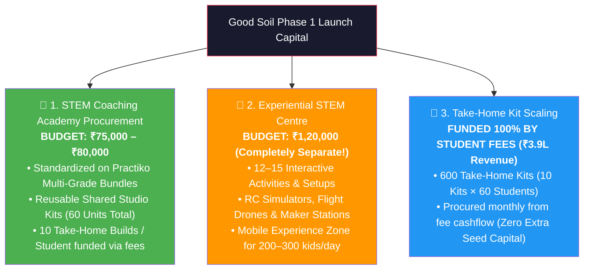

# Good Soil — Phase 1 Kit Procurement Bill of Materials (BOM) & Budget Sheet

> **Document Version:** 2.0 (Refactored & Aligned)  
> **Target Program:** 6-Month STEM & Robotics Pilot (60 Students: 30 Junior + 30 Senior)  
> **Master Excel Workbook:** [`Budget/GoodSoil_Phase1_Kit_Procurement_BOM_Updated.xlsx`](file:///c:/Users/vizzu/Desktop/Good%20Soil/Budget/GoodSoil_Phase1_Kit_Procurement_BOM_Updated.xlsx) *(or [`GoodSoil_Phase1_Kit_Procurement_BOM.xlsx`](file:///c:/Users/vizzu/Desktop/Good%20Soil/Budget/GoodSoil_Phase1_Kit_Procurement_BOM.xlsx))*  
> **Curriculum Reference:** [`Curriculum/curriculum_plan.md`](file:///c:/Users/vizzu/Desktop/Good%20Soil/Curriculum/curriculum_plan.md)  
> **Kit Database Reference:** [`Vendor Research/GoodSoil_Kit_Catalogue.xlsx`](file:///c:/Users/vizzu/Desktop/Good%20Soil/Vendor%20Research/GoodSoil_Kit_Catalogue.xlsx)

---

## 1. Executive Budget Architecture (Two Independent Budgets)

```mermaid
graph TD
    GS["Good Soil Phase 1 Launch Capital"]
    GS --> B1["🎯 1. STEM Coaching Academy Procurement<br/><b>BUDGET: ₹75,000 – ₹80,000</b><br/>• Standardized on Practiko Multi-Grade Bundles<br/>• Reusable Shared Studio Kits (60 Units Total)<br/>• 10 Take-Home Builds / Student funded via fees"]
    GS --> B2["🎪 2. Experiential STEM Centre<br/><b>BUDGET: ₹1,20,000 (Completely Separate!)</b><br/>• 12–15 Interactive Activities & Setups<br/>• RC Simulators, Flight Drones & Maker Stations<br/>• Mobile Experience Zone for 200–300 kids/day"]
    GS --> B3["🎁 3. Take-Home Kit Scaling<br/><b>FUNDED 100% BY STUDENT FEES (₹3.9L Revenue)</b><br/>• 600 Take-Home Kits (10 Kits × 60 Students)<br/>• Procured monthly from fee cashflow (Zero Extra Seed Capital)"]

    style GS fill:#1a1a2e,color:#fff,stroke:#e94560
    style B1 fill:#4CAF50,color:#fff
    style B2 fill:#FF9800,color:#fff
    style B3 fill:#2196F3,color:#fff
```

### Clean Budget Breakdown Matrix

| Budget Parameter | Coaching Academy In-Class Sets *(Model A — Seed Outlay)* | Experiential STEM Centre *(Separate Seed Budget)* | Student Take-Home Scaling *(Model C — Self-Funded)* |
| :--- | :--- | :--- | :--- |
| **Allocated Budget** | **₹75,000 – ₹80,000** | **₹1,20,000** | **₹0 Upfront** *(Funded via Tuition)* |
| **Target Audience** | 60 Enrolled Students (30 Jr + 30 Sr) | 200–300 Walk-in Students / Day | 60 Enrolled Students (10 Take-Homes each) |
| **Unit Scope** | **60 Shared Studio Sets** (reused across Sat/Sun) | **12–15 Mobile Interactive Stations** | **600 Take-Home Units** |
| **Junior Component** | **₹40,502** *(Retail benchmark for 3 units)* | Included in ₹1.2L Allocation | **₹1,37,174** *(30 kids × 10 kits with bulk discount)* |
| **Senior Component** | **₹52,718** *(Retail benchmark for 3 units)* | Included in ₹1.2L Allocation | **₹1,70,416** *(30 kids × 10 kits with bulk discount)* |
| **Consumables & Buffer**| **₹8,000** *(Tools, spares, packaging)* | Included in ₹1.2L Allocation | **₹10,000** *(Boxes, passports, stickers)* |
| **Total Cost** | **~₹75,000 – ₹80,000** *(With 15–20% Practiko bundle discount)*| **₹1,20,000** | **~₹3,17,590 Bulk / ₹3,73,870 Retail** |
| **Funding Source** | **Good Soil Upfront Seed Capital** | **Good Soil Experiential Seed Fund** | **Student Fees (30×₹5K + 30×₹8K = ₹3.9L)** |
| **Net Operational Cash** | Break-even seed allocation | Capital investment | **+₹72,410 Gross Cash Surplus** |

---

## 2. Junior Batch (Ages 6–9 / Grades 1–4) — Complete Kit Procurement List

> **Age Focus:** 6 to 9 Years Old (Elementary STEM & Robotics). Aligned with Modules 1–15 of the Robotics Curriculum, Practiko Multi-Grade bundles, and Indian aeromodelling balsa tracks.

**Total Classes:** 25 &nbsp;|&nbsp; **10 Take-Home Kits** &nbsp;|&nbsp; **10 Group Studio Sets** &nbsp;|&nbsp; **4 Assessment Challenges** &nbsp;|&nbsp; **1 Grand Expo**

| Class | Framework Module | Kit / Activity Name | Vendor | SKU / Code | Format | Domain | Unit Price | Studio Qty (Model A) | Studio Cost | Take-Home Qty (Model B/C) | Take-Home Cost | Good Soil Catalogue Link |
|:---:|:---|:---|:---|:---|:---:|:---|:---:|:---:|:---:|:---:|:---:|:---|
| **01** | Module 1: Meet the Robots | Human vs. Robot Explorer Station | Practiko Mechatronics / Demo | `PRA-MECH-01` | 🤝 Group | 🤖 Robotics I | ₹500 | 3 | ₹1,500 | 3 | ₹1,500 | [View in Catalogue](https://good-soil.onrender.com/?q=Mechatronics) |
| **02** | Module 2: Instructions to Robots | Floor Grid Robot Maze & Code Cards | Unplugged / Practiko Logic | `STUDIO-CODE-01`| 🤝 Group | 💻 Algorithms | ₹350 | 3 | ₹1,050 | 3 | ₹1,050 | [View in Catalogue](https://good-soil.onrender.com/?q=Maze) |
| **03** | Module 3: Components of a Robot | 5 Organs of a Robot Dissection Lab | Practiko Electrical Circuit Lab | `PRA-ELEC-01` | 🤝 Group | ⚡ Anatomy | ₹450 | 3 | ₹1,350 | 3 | ₹1,350 | [View in Catalogue](https://good-soil.onrender.com/?q=Circuit) |
| **04** | Module 4: BreadBoard Intro | Junior Snap / Pinboard LED Circuit | Good Soil Modular Starter | `STUDIO-SNAP-01`| 🎁 Giveaway | ⚡ Circuits | ₹350 | 3 | ₹1,050 | 30 | ₹10,500 | [View in Catalogue](https://good-soil.onrender.com/?q=Pinboard) |
| **05** | Module 5: Electricity & Power | Electric Propeller & Aerodynamic Wind Car | Pludo (Robocraze) | `WEB-PLU-015` | 🎁 Giveaway | ⚡ Electricity | ₹467 | 3 | ₹1,401 | 30 | ₹14,010 | [View in Catalogue](https://good-soil.onrender.com/?id=WEB-PLU-015) |
| **06** | 🏆 Assessment 1 (Milestone) | Assessment 1: Island Escape & Circuit Maze | Good Soil Studio | `STUDIO-ASSESS-01`| 🏆 Test | 🎯 Challenge | ₹200 | 3 | ₹600 | 3 | ₹600 | [View in Catalogue](https://good-soil.onrender.com/?q=Assessment) |
| **07** | Module 6: Sensors — Part I | Automatic Night-Glow Sensor Lamp | Practiko / Kiddale | `WEB-KDA-042` | 🎁 Giveaway | ⚡ Sensors I | ₹424 | 3 | ₹1,272 | 30 | ₹12,720 | [View in Catalogue](https://good-soil.onrender.com/?id=WEB-KDA-042) |
| **08** | Module 7: Sensors & Buzzers | Morse Code Telegraph & Buzzer Station | Good Soil Studio | `STUDIO-ELEC-01` | 🎁 Giveaway | ⚡ Sensors II | ₹250 | 3 | ₹750 | 30 | ₹7,500 | [View in Catalogue](https://good-soil.onrender.com/?q=Telegraph) |
| **09** | Module 8: Sensor & Switches | 2-Way Reversible Motor & Railway Gate | Practiko Mechatronics | `PRA-MECH-02` | 🤝 Group | ⚙️ Switches | ₹450 | 3 | ₹1,350 | 3 | ₹1,350 | [View in Catalogue](https://good-soil.onrender.com/?q=Switch) |
| **10** | Module 9: Motors & Movement | Mechanical Gearbox & Carousel Machine | Practiko Kinematics / Kiddale | `WEB-KDA-032` | 🤝 Group | ⚙️ Mechanics | ₹424 | 3 | ₹1,272 | 3 | ₹1,272 | [View in Catalogue](https://good-soil.onrender.com/?id=WEB-KDA-032) |
| **11** | Module 10: Build a Moving Robot | Junior 2-Wheel Rover Build (Milestone!) | Good Soil Dual-Motor Rover | `WEB-KDA-140` | 🎁 Giveaway | 🤖 Robotics II | ₹499 | 3 | ₹1,497 | 30 | ₹14,970 | [View in Catalogue](https://good-soil.onrender.com/?id=WEB-KDA-140) |
| **12** | 🏆 Assessment 2 (Milestone) | Assessment 2: Great Rover Derby Track | Good Soil Studio | `STUDIO-ASSESS-02`| 🏆 Test | 🎯 Challenge | ₹200 | 3 | ₹600 | 3 | ₹600 | [View in Catalogue](https://good-soil.onrender.com/?q=Assessment) |
| **13** | Module 11: Intro to MCU | Micro:bit / Block Brain First Blink | Practiko / Micro:bit Station | `PRA-MCU-01` | 🤝 Group | 💻 MCU I | ₹650 | 3 | ₹1,950 | 3 | ₹1,950 | [View in Catalogue](https://good-soil.onrender.com/?q=Microbit) |
| **14** | Module 12: MCU I/O & Sound | Interactive Sound & Emotion Display | Practiko Mechatronics | `PRA-MECH-03` | 🤝 Group | 💻 MCU II | ₹650 | 3 | ₹1,950 | 3 | ₹1,950 | [View in Catalogue](https://good-soil.onrender.com/?q=OLED) |
| **15** | Module 13: MCU Projects | Smart Security Room Guard / Gate Alarm | Good Soil Ultrasonic Kit | `STUDIO-SEC-01` | 🎁 Giveaway | 🤖 Automation | ₹450 | 3 | ₹1,350 | 30 | ₹13,500 | [View in Catalogue](https://good-soil.onrender.com/?q=Ultrasonic) |
| **16** | Module 14: Loops & Repetition | Looping Light Patrol & Dancing Bot | Practiko Mechatronics | `PRA-MECH-04` | 🤝 Group | 💻 Logic | ₹500 | 3 | ₹1,500 | 3 | ₹1,500 | [View in Catalogue](https://good-soil.onrender.com/?q=Loop) |
| **17** | ✈️ Aeromodelling Track I | High-Lift Balsa & Foam Chuck Gliders | Crossvind / Indian Aero Fun | `CUSTOM-AERO-01`| 🤝 Group | ✈️ Aero I | ₹200 | 3 | ₹600 | 3 | ₹600 | [View in Catalogue](https://crossvindsolutions.com) |
| **18** | 🏆 Assessment 3 (Milestone) | Assessment 3: Sky Patrol & Beacon Derby | Good Soil Studio | `STUDIO-ASSESS-03`| 🏆 Test | 🎯 Challenge | ₹200 | 3 | ₹600 | 3 | ₹600 | [View in Catalogue](https://good-soil.onrender.com/?q=Assessment) |
| **19** | Module 15: Robot Mechanics I | Walking Bionic T-Rex / Crab Linkage | Kiddale / Practiko | `WEB-KDA-039` | 🎁 Giveaway | 🤖 Mechanics I | ₹594 | 3 | ₹1,782 | 30 | ₹17,820 | [View in Catalogue](https://good-soil.onrender.com/?id=WEB-KDA-039) |
| **20** | Robot Mechanics II | Wooden Catapult & Trajectory Launcher | Practiko Mechanics | `WEB-PRA-052` | 🎁 Giveaway | ⚙️ Mechanics II | ₹499 | 3 | ₹1,497 | 30 | ₹14,970 | [View in Catalogue](https://good-soil.onrender.com/?id=WEB-PRA-052) |
| **21** | ✈️ Aeromodelling Track II | Rubber-Band High-Endurance Plane | Good Soil Aero Track | `CUSTOM-AERO-02`| 🎁 Giveaway | ✈️ Aero II | ₹350 | 3 | ₹1,050 | 30 | ₹10,500 | [View in Catalogue](https://good-soil.onrender.com/?q=Rubber) |
| **22** | ✈️ Aeromodelling Track III | Mini-Drone Flight Discovery Station | BrainHap / Studio | `WEB-BRH-003` | 🤝 Group | ✈️ Drones | ₹2,999 | 1 | ₹2,999 | 1 | ₹2,999 | [View in Catalogue](https://good-soil.onrender.com/?id=WEB-BRH-003) |
| **23** | Clean Energy & Capstone | Solar-Powered Eco Rover Car | Kiddale | `WEB-KDA-043` | 🎁 Giveaway | ⚡ Clean Energy | ₹594 | 3 | ₹1,782 | 30 | ₹17,820 | [View in Catalogue](https://good-soil.onrender.com/?id=WEB-KDA-043) |
| **24** | 🏆 Assessment 4 (Milestone) | Assessment 4: Young Inventors Pitch Arena | Good Soil Studio | `STUDIO-ASSESS-04`| 🏆 Test | 🎯 Challenge | ₹250 | 3 | ₹750 | 3 | ₹750 | [View in Catalogue](https://good-soil.onrender.com/?q=Assessment) |
| **25** | 🎓 Grand Capstone Expo | Grand Expo: Medals, Badges & Certs | Good Soil Studio | `STUDIO-EXPO-01` | 🎓 Expo | 🌟 Graduation | ₹300 | 30 | ₹9,000 | 30 | ₹9,000 | [View in Catalogue](https://good-soil.onrender.com/) |
| **TOTAL** | **Junior Batch 25-Class Total** | — | — | — | — | — | — | — | **₹40,502** | — | **₹1,61,381** | [Open Master Catalogue](https://good-soil.onrender.com/) |

---

## 3. Senior Batch (Ages 10–14 / Grades 5–9) — Complete Kit Procurement List

> **Age Focus:** 10 to 14 Years Old (Middle School STEM & Robotics). Focuses on breadboard prototyping, Ohm’s Law, discrete analog/digital electronics, Arduino embedded microcontrollers, kinematics, and quadcopter avionics.

**Total Classes:** 25 &nbsp;|&nbsp; **10 Take-Home Kits** &nbsp;|&nbsp; **10 Group Studio Sets** &nbsp;|&nbsp; **4 Assessment Challenges** &nbsp;|&nbsp; **1 Grand Expo**

| Class | Framework Module | Kit / Activity Name | Vendor | SKU / Code | Format | Domain | Unit Price | Studio Qty (Model A) | Studio Cost | Take-Home Qty (Model B/C) | Take-Home Cost | Good Soil Catalogue Link |
|:---:|:---|:---|:---|:---|:---:|:---|:---:|:---:|:---:|:---:|:---:|:---|
| **01** | Module 1: Meet the Robots | Autonomous Systems & DoF Dissection | Practiko Mechatronics | `PRA-MECH-S01`| 🤝 Group | 🤖 Robotics I | ₹600 | 3 | ₹1,800 | 3 | ₹1,800 | [View in Catalogue](https://good-soil.onrender.com/?q=Robotics) |
| **02** | Module 2: Instructions to Robots | Pseudocode, State Machines & Flowcharts | Practiko AI Kit | `PRA-AI-01` | 🤝 Group | 💻 Logic | ₹450 | 3 | ₹1,350 | 3 | ₹1,350 | [View in Catalogue](https://good-soil.onrender.com/?q=AI) |
| **03** | Module 3: Components of a Robot | Hardware BOM & Signal Routing Lab | Practiko Electrical Science | `PRA-ELEC-S01`| 🤝 Group | ⚡ Schematics | ₹500 | 3 | ₹1,500 | 3 | ₹1,500 | [View in Catalogue](https://good-soil.onrender.com/?q=Electrical) |
| **04** | Module 4: BreadBoard Intro | Half-Size Solderless Breadboard Lab | Good Soil Prototyping Pack | `STUDIO-BREAD-01`| 🎁 Giveaway | ⚡ Breadboard | ₹399 | 3 | ₹1,197 | 30 | ₹11,970 | [View in Catalogue](https://good-soil.onrender.com/?q=Breadboard) |
| **05** | Module 5: Electricity & Power | Multi-Voltage Power Supply & Test Station | Practiko Electrical Science | `PRA-ELEC-S02`| 🎁 Giveaway | ⚡ Power Lab | ₹549 | 3 | ₹1,647 | 30 | ₹16,470 | [View in Catalogue](https://good-soil.onrender.com/?q=Power) |
| **06** | 🏆 Assessment 1 (Milestone) | Assessment 1: Circuit Diagnostics Hackathon| Good Soil Studio | `STUDIO-ASSESS-01S`| 🏆 Test | 🎯 Challenge | ₹250 | 3 | ₹750 | 3 | ₹750 | [View in Catalogue](https://good-soil.onrender.com/?q=Assessment) |
| **07** | Module 6: Sensors — Part I | Precision LDR Light Sensor & Divider Bench | Good Soil Sensor Lab | `STUDIO-SENS-01`| 🎁 Giveaway | ⚡ Sensors I | ₹450 | 3 | ₹1,350 | 30 | ₹13,500 | [View in Catalogue](https://good-soil.onrender.com/?q=LDR) |
| **08** | Module 7: Sensors & Buzzers | Transistor-Driven Piezo Alarm Circuit | Good Soil Electronics Lab | `STUDIO-SE-02` | 🎁 Giveaway | ⚡ Sensors II | ₹450 | 3 | ₹1,350 | 30 | ₹13,500 | [View in Catalogue](https://good-soil.onrender.com/?q=Transistor) |
| **09** | Module 8: Sensor & Switches | Relay Logic & Reversible DPDT Motor Drive | Practiko Mechatronics | `PRA-MECH-S02`| 🤝 Group | ⚙️ Switches | ₹600 | 3 | ₹1,800 | 3 | ₹1,800 | [View in Catalogue](https://good-soil.onrender.com/?q=Relay) |
| **10** | Module 9: Motors & Movement | Dual-Motor Gear Ratio & Speed/Torque Bench| Practiko Kinematics | `PRA-KIN-S01` | 🤝 Group | ⚙️ Gear Ratios | ₹650 | 3 | ₹1,950 | 3 | ₹1,950 | [View in Catalogue](https://good-soil.onrender.com/?q=Kinematics) |
| **11** | Module 10: Build a Moving Robot | 4WD Heavy-Duty Obstacle Rover Chassis | Good Soil 4WD Platform | `STUDIO-ROV-01` | 🎁 Giveaway | 🤖 Robotics II | ₹749 | 3 | ₹2,247 | 30 | ₹22,470 | [View in Catalogue](https://good-soil.onrender.com/?q=Rover) |
| **12** | 🏆 Assessment 2 (Milestone) | Assessment 2: Autonomous Rescue Rover Challenge| Good Soil Studio | `STUDIO-ASSESS-02S`| 🏆 Test | 🎯 Challenge | ₹250 | 3 | ₹750 | 3 | ₹750 | [View in Catalogue](https://good-soil.onrender.com/?q=Assessment) |
| **13** | Module 11: Intro to MCU | Arduino / Microcontroller Embedded Core | Practiko Mechatronics | `PRA-MCU-S01` | 🤝 Group | 💻 MCU I | ₹850 | 3 | ₹2,550 | 3 | ₹2,550 | [View in Catalogue](https://good-soil.onrender.com/?q=Arduino) |
| **14** | Module 12: MCU I/O & PWM | Analog Read & PWM Motor Speed Control | Practiko Mechatronics | `PRA-MCU-S02` | 🤝 Group | 💻 MCU II | ₹850 | 3 | ₹2,550 | 3 | ₹2,550 | [View in Catalogue](https://good-soil.onrender.com/?q=PWM) |
| **15** | Module 13: MCU Projects | Ultrasonic Radar Distance & Collision Guard| Good Soil Ultrasonic Kit | `STUDIO-RAD-01` | 🎁 Giveaway | 🤖 Sonar | ₹699 | 3 | ₹2,097 | 30 | ₹20,970 | [View in Catalogue](https://good-soil.onrender.com/?q=Sonar) |
| **16** | Module 14: Loops & Repetition | State Machines & Edge-Avoiding Autonomy | Practiko Mechatronics | `PRA-MECH-S03`| 🤝 Group | 💻 Autonomy | ₹850 | 3 | ₹2,550 | 3 | ₹2,550 | [View in Catalogue](https://good-soil.onrender.com/?q=State) |
| **17** | ✈️ Aeromodelling Track I | Aeronautical Airfoils & Large Balsa Glider | Crossvind Crossbird (40 cm) | `CUSTOM-AERO-03`| 🤝 Group | ✈️ Aero I | ₹450 | 3 | ₹1,350 | 3 | ₹1,350 | [View in Catalogue](https://crossvindsolutions.com) |
| **18** | 🏆 Assessment 3 (Milestone) | Assessment 3: Avionics & Radar Arena Trial | Good Soil Studio | `STUDIO-ASSESS-03S`| 🏆 Test | 🎯 Challenge | ₹250 | 3 | ₹750 | 3 | ₹750 | [View in Catalogue](https://good-soil.onrender.com/?q=Assessment) |
| **19** | Module 15: Robot Mechanics I | Kinematics: Linkages, JCB & Slider-Cranks | Practiko Kinematics Master Kit | `PRA-KIN-S02` | 🤝 Group | ⚙️ Kinematics | ₹750 | 3 | ₹2,250 | 3 | ₹2,250 | [View in Catalogue](https://good-soil.onrender.com/?q=JCB) |
| **20** | Robot Mechanics II | Hydraulic Mech Gripper Robot Arm | Practiko Hydraulics / Kintaro | `WEB-KIN-001` | 🎁 Giveaway | 💧 Hydraulics | ₹749 | 3 | ₹2,247 | 30 | ₹22,470 | [View in Catalogue](https://good-soil.onrender.com/?id=WEB-KIN-001) |
| **21** | ✈️ Aeromodelling Track II | Motorized Electric DIY Aircraft | Pludo (Robocraze) | `WEB-PLU-074` | 🎁 Giveaway | ✈️ Aero II | ₹629 | 3 | ₹1,887 | 30 | ₹18,870 | [View in Catalogue](https://good-soil.onrender.com/?id=WEB-PLU-074) |
| **22** | ✈️ Aeromodelling Track III | BrainHap Quadcopter Flight & Telemetry | BrainHap Drone Kit | `WEB-BRH-003` | 🤝 Group | ✈️ Drones | ₹2,999 | 1 | ₹2,999 | 1 | ₹2,999 | [View in Catalogue](https://good-soil.onrender.com/?id=WEB-BRH-003) |
| **23** | Advanced IoT & Capstone | Smart Connected IoT Rover / Weather Node | Practiko IoT Platform | `PRA-IOT-01` | 🎁 Giveaway | 🌐 IoT & Cloud | ₹799 | 3 | ₹2,397 | 30 | ₹23,970 | [View in Catalogue](https://good-soil.onrender.com/?q=IoT) |
| **24** | 🏆 Assessment 4 (Milestone) | Assessment 4: Shark Tank & Capstone Defense| Good Soil Studio | `STUDIO-ASSESS-04S`| 🏆 Test | 🎯 Challenge | ₹300 | 3 | ₹900 | 3 | ₹900 | [View in Catalogue](https://good-soil.onrender.com/?q=Assessment) |
| **25** | 🎓 Grand Capstone Expo | Senior Tech Symposium: Trophies & Certs | Good Soil Studio | `STUDIO-EXPO-02` | 🎓 Expo | 🌟 Graduation | ₹350 | 30 | ₹10,500 | 30 | ₹10,500 | [View in Catalogue](https://good-soil.onrender.com/) |
| **TOTAL** | **Senior Batch 25-Class Total** | — | — | — | — | — | — | — | **₹52,718** | — | **₹2,00,489** | [Open Master Catalogue](https://good-soil.onrender.com/) |

---

## 4. Key Vendor RFQ & Wholesale Allocation Matrix

| Vendor / Partner | Primary Bundles & SKUs | Est. Studio Volume | Est. Take-Home Volume | Est. Total Value (₹) | Target Discount | Primary Contact / URL |
| :--- | :--- | :---: | :---: | :---: | :---: | :--- |
| **Practiko Learning** | Mechatronics Master Kit, Kinematics Kit, Electrical Science, Hydraulics, IoT Node | 3 Master Bundles | 90 Take-Home Units | ₹95,000 | 15% – 20% B2B | `sales@practiko.in` \| [practiko.in](https://practiko.in) |
| **Crossvind Solutions** | All-Balsa Chuck Gliders (Little Pakshi 16cm, Tiny Tiya, Crossbird 40cm) | 6 Studio Gliders | 60 Take-Home Gliders | ₹18,500 | 20% Volume | `+91 98114 75262` \| [crossvindsolutions.com](https://crossvindsolutions.com) |
| **Pludo / Robocraze** | Wind Cars (`WEB-PLU-015`), Motorized Electric Aircraft (`WEB-PLU-074`) | 6 Studio Units | 60 Take-Home Units | ₹35,000 | 15% Institutional | `support@robocraze.com` \| [robocraze.com](https://robocraze.com) |
| **Kiddale Toys** | Bionic Walking T-Rex (`WEB-KDA-039`), Solar Rover (`WEB-KDA-043`), Night Lamp (`WEB-KDA-042`) | 9 Studio Units | 90 Take-Home Units | ₹42,000 | 18% Wholesale | `sales@kiddale.com` \| [kiddale.com](https://kiddale.com) |
| **BrainHap Technologies**| Beginner HD Camera Drone Kit (`WEB-BRH-003`), Indoor Ducted Station | 2 Master Stations | 2 Demo Units | ₹6,000 | Direct Wholesale | `support@brainhap.com` \| [brainhap.com](https://brainhap.com) |
| **Good Soil In-House Lab**| Half-Breadboards, Jumper Sets, Assessment Mats, Medals, Passports & Diplomas | Shared Studio | 60 Full Student Sets | ₹45,000 | Direct Assembly | In-House Studio Assembly |
