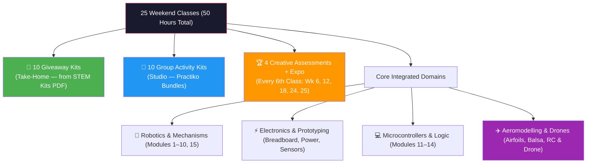
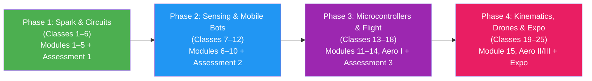
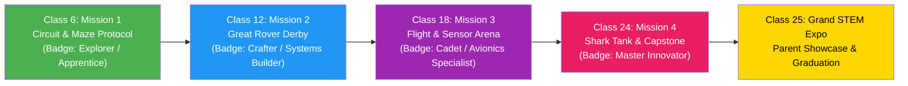

# Good Soil — 25-Class Master STEM & Robotics Curriculum Outline
> **Version:** 3.0 — Merged & Finalised  
> **Sources Merged:**  
> &nbsp;&nbsp;&nbsp;① *Good Soil Robotics Curriculum Draft* (15-module sequence spine)  
> &nbsp;&nbsp;&nbsp;② *GoodSoil Junior & Senior STEM Kits PDF* (verified take-home giveaway kit picks)  
> &nbsp;&nbsp;&nbsp;③ *Practiko Multi-Grade Institutional Bundles PDF* (group / studio collaborative kits)  

> **Target Batches:** Junior (Ages 6–9 / Grades 1–4) & Senior (Ages 10–14 / Grades 5–9)  
> **Structure:** 25 Weekend Classes (2 Hours each with 10-min break — 50 Hours Total)  
> **Core Architecture:** 10 Giveaway (Take-Home) Kits + 10 Collaborative Group Kits + 4 Gamified Milestone Assessments + 1 Grand Capstone Expo.  
> **Mantra:** *Learn → Play → Build → Compete → Take Home*

---

## 1. Curriculum Architecture & Mix

### Class Distribution Summary

| Class Category | Number of Classes | Description & Pedagogical Purpose |
| :--- | :---: | :--- |
| **🎁 Giveaway (Take-Home) Kits** | **10** | Individual builds that students construct, calibrate, take home, and demonstrate to parents. Sourced from verified kit vendors (Kiddale, Pludo, Kintaro, etc.). |
| **🤝 Studio Group Activity Kits** | **10** | Reusable Practiko multi-grade institutional bundles (Mechatronics, Kinematics, Electrical Science, Hydraulics, AI Kit) — shared per team of 4–5. |
| **🏆 Creative Milestone Assessments** | **4** | Gamified team challenges every 6th class (Classes 6, 12, 18, 24) — no paper exams. |
| **🎓 Grand Capstone Expo** | **1** | Class 25: Public flight arena, live robot racing, parent demos, certification & STEM Passport graduation. |
| **Total** | **25** | **Complete 6-Month STEM Odyssey (50 Class Hours)** |

---

## 2. 4-Phase Progression

### Session Architecture (120 Minutes per Class)

| Stage | Duration | What Happens |
|:---|:---:|:---|
| **1. Starter & Discovery** | 20–25 min | Touch loose components, live instructor demo, hypothesis testing |
| **2. Guided Project Build** | 50–55 min | Step-by-step assembly, solderless breadboarding, individual/team build |
| **3. Testing, Challenge & STEM Passport** | 40–45 min | Benchmark measurements, troubleshooting, passport reflection entry |

---

## 3. Junior Batch (Ages 6–9 / Grades 1–4) — Merged 25-Class Syllabus

> **Group Kit Source:** Practiko Institutional Bundles (Mechatronics Kit, Electrical Circuit Kit, Kinematics Kit)  
> **Giveaway Kit Source:** Good Soil Junior & Senior STEM Kits PDF (verified vendors: Kiddale, Pludo, Crossvind, Good Soil Studio)

| Class | Phase | Framework Module | Kit Type | Kit / Activity Name | Kit Source / Vendor | Key Concept & Learning Outcome |
| :---: | :---: | :--- | :---: | :--- | :--- | :--- |
| **01** | P1 | **Module 1: Meet the Robots** | 🤝 Group #1 | **Human vs. Robot Explorer Station** | Practiko — Mechatronics Kit `PRA-MECH-01` | Tools vs. automated machines vs. autonomous robots; sensory organs vs. robot sensors. |
| **02** | P1 | **Module 2: Instructions to Robots** | 🤝 Group #2 | **Floor Grid Robot Maze & Code Cards** | Good Soil Studio (Unplugged) `STUDIO-CODE-01` | Step-by-step sequencing, directional commands, debugging a path, algorithmic thinking. |
| **03** | P1 | **Module 3: Components of a Simple Robot** | 🤝 Group #3 | **5 Organs of a Robot Dissection Lab** | Practiko — Electrical Circuit Kit `PRA-CIRC-01` | Power (Battery), Input (Sensors), Brain (Controller), Output (Actuators), Body (Chassis). |
| **04** | P1 | **Module 4: BreadBoard — An Introduction** | 🎁 Giveaway #1 | **Junior Snap / Pinboard LED Circuit** | Good Soil Studio `STUDIO-SNAP-01` | Solderless connections, power rails, closed loops, LED lighting without soldering. |
| **05** | P1 | **Module 5: Electricity: Powering a Robot** | 🎁 Giveaway #2 | **Electric Propeller & Aerodynamic Wind Car** | Pludo (Robocraze) `WEB-PLU-015` | Battery polarity, DC motor spin direction, open vs. closed circuits, aerodynamic thrust. |
| **06** | P1 | **🏆 ASSESSMENT 1** | 🎯 Creative Test | **"Mission: Island Escape & Circuit Maze"** | Good Soil Studio `STUDIO-ASSESS-01` | Fix a broken beacon circuit, navigate unplugged rescue grid, launch SOS propeller car. (Badge: *Junior Explorer*) |
| **07** | P2 | **Module 6: Sensors — Part I** | 🎁 Giveaway #3 | **Wooden Glow Table Lamp & Switch Circuit** | Kiddale `WEB-KDA-042` | Light-dependent resistors (LDR), automated switching in darkness, closed-loop sensing. |
| **08** | P2 | **Module 7: Sensors & Buzzers — Part II** | 🎁 Giveaway #4 | **Morse Code Telegraph & Buzzer Station** | Good Soil Studio `STUDIO-ELEC-01` | Piezo buzzers, sound vibrations, binary sound signals, Morse code emergency alarms. |
| **09** | P2 | **Module 8: Sensor & Switches** | 🤝 Group #4 | **2-Way Reversible Motor & Railway Gate** | Practiko — Mechatronics Kit `PRA-MECH-02` | Push buttons, toggle switches, polarity reversal, forward/reverse motor motion control. |
| **10** | P2 | **Module 9: Motors: Making Robots Move** | 🤝 Group #5 | **Mechanical Gearbox & Carousel Machine** | Kiddale `WEB-KDA-032` | Spur gears, driver vs. driven gears, speed vs. torque, gear ratio transmission. |
| **11** | P2 | **Module 10: Build a Moving Robot** | 🎁 Giveaway #5 | **Junior 2-Wheel Obstacle Rover Build** | Kiddale `WEB-KDA-140` | Full robot integration: chassis, battery box, toggle switch, dual DC motors, wheel alignment. |
| **12** | P2 | **🏆 ASSESSMENT 2** | 🎯 Creative Test | **"The Great Rover Derby & Agility Track"** | Good Soil Studio `STUDIO-ASSESS-02` | Time trial slalom, gear-ratio torque climbing ramp, precision stopping. (Badge: *Master Crafter*) |
| **13** | P3 | **Module 11: Intro to Microcontroller** | 🤝 Group #6 | **Micro:bit / Block Brain First Blink** | Practiko — Mechatronics Kit `PRA-MCU-01` | Robot brains, GPIO pins, block coding, uploading first LED animation and display routines. |
| **14** | P3 | **Module 12: Microcontroller — Part II** | 🤝 Group #7 | **Interactive Sound & Emotion Display** | Practiko — Mechatronics Kit `PRA-MECH-03` | Button event triggers, animated facial expressions, sound tone synthesis on OLED display. |
| **15** | P3 | **Module 13: Microcontroller Projects** | 🎁 Giveaway #6 | **Smart Security Room Guard / Gate Alarm** | Good Soil Studio `STUDIO-SEC-01` | Ultrasonic distance sensing, intruder detection threshold, automated alarm triggering. |
| **16** | P3 | **Module 14: Loops & Repetition** | 🤝 Group #8 | **Looping Light Patrol & Dancing Bot** | Practiko — Mechatronics Kit `PRA-MECH-04` | While/repeat loops, continuous automation routines, creating persistent state behaviors. |
| **17** | P3 | **✈️ Aeromodelling Track I** | 🤝 Group #9 | **High-Lift Balsa & Foam Chuck Gliders** | Crossvind Solutions `CUSTOM-AERO-01` | Lift, weight, thrust, drag; CG balancing, dihedral wing stability, glide-ratio tuning. |
| **18** | P3 | **🏆 ASSESSMENT 3** | 🎯 Creative Test | **"The Sky Patrol & Sensor Beacon Derby"** | Good Soil Studio `STUDIO-ASSESS-03` | Longest glide distance contest + landing on a sensor target pad. (Badge: *Flight Cadet*) |
| **19** | P4 | **Module 15: Robot Mechanics — Part I** | 🎁 Giveaway #7 | **Walking Bionic T-Rex / Crab Linkage** | Kiddale `WEB-KDA-039` | 4-bar linkages, crank mechanisms, converting rotation into rhythmic walking gait. |
| **20** | P4 | **Robot Mechanics — Part II** | 🎁 Giveaway #8 | **Wooden Catapult & Trajectory Launcher** | Practiko `WEB-PRA-052` | Levers, fulcrums, mechanical advantage, elastic potential energy to kinetic motion. |
| **21** | P4 | **✈️ Aeromodelling Track II** | 🎁 Giveaway #9 | **Rubber-Band Powered High-Endurance Plane** | Good Soil Aero Track `CUSTOM-AERO-02` | Propeller pitch, rubber motor energy storage, glide ratio extension, sustained flight. |
| **22** | P4 | **✈️ Aeromodelling Track III** | 🤝 Group #10 | **Mini-Drone Flight Discovery Station** | BrainHap Technologies `WEB-BRH-003` | Quadcopter physics: counter-rotating rotors, roll/pitch/yaw joystick control, hover dynamics. |
| **23** | P4 | **Clean Energy & Capstone Assembly** | 🎁 Giveaway #10 | **Solar-Powered Eco Rover Car** | Kiddale `WEB-KDA-043` | Photovoltaic cells, solar-to-electric conversion, capstone showcase preparation. |
| **24** | P4 | **🏆 ASSESSMENT 4** | 🎯 Creative Test | **"Young Inventors Showcase & Pitch Arena"** | Good Soil Studio `STUDIO-ASSESS-04` | Teams demonstrate builds, explain circuit diagrams, defend design choices. (Badge: *Young Innovator*) |
| **25** | P4 | **🎓 GRAND EXPO** | 🌟 Showcase Day | **Good Soil Junior STEM Expo & Graduation** | Good Soil Studio `STUDIO-EXPO-01` | Robot arena, live glider showcase, parent demos, medal ceremony & STEM Passport graduation. |

---

## 4. Senior Batch (Ages 10–14 / Grades 5–9) — Merged 25-Class Syllabus

> **Group Kit Source:** Practiko Institutional Bundles (Mechatronics Kit, AI Kit, Electrical Science Kit, Kinematics Kit, Automation/IoT Kit)  
> **Giveaway Kit Source:** Good Soil Junior & Senior STEM Kits PDF (verified vendors: Kintaro DIY, Pludo, BrainHap, Good Soil Studio)

| Class | Phase | Framework Module | Kit Type | Kit / Activity Name | Kit Source / Vendor | Key Concept & Learning Outcome |
| :---: | :---: | :--- | :---: | :--- | :--- | :--- |
| **01** | P1 | **Module 1: Meet the Robots** | 🤝 Group #1 | **Autonomous Systems & DoF Dissection** | Practiko — Mechatronics Kit `PRA-MECH-S01` | Degrees of Freedom (DoF), kinematic chains, Cartesian vs. articulated robot architectures. |
| **02** | P1 | **Module 2: Instructions to Robots** | 🤝 Group #2 | **Pseudocode, State Machines & Flowcharts** | Practiko — AI Kit `PRA-AI-01` | Algorithmic logic, IF-THEN-ELSE decision branches, state transition diagrams for autonomous systems. |
| **03** | P1 | **Module 3: Components of a Simple Robot** | 🤝 Group #3 | **Hardware BOM & Signal Routing Lab** | Practiko — Electrical Science Kit `PRA-ELEC-S01` | Circuit schematics, digital vs. analog signaling, component datasheets, power bus routing. |
| **04** | P1 | **Module 4: BreadBoard — An Introduction** | 🎁 Giveaway #1 | **Half-Size Solderless Breadboard Lab** | Good Soil Studio `STUDIO-BREAD-01` | Breadboard architecture: power rails, 5V/GND bus discipline, IC tie-points, jumper wiring. |
| **05** | P1 | **Module 5: Electricity: Powering a Robot** | 🎁 Giveaway #2 | **Multi-Voltage Power Supply & Test Station** | Practiko — Electrical Science Kit `PRA-ELEC-S02` | Ohm's Law (V=IR), series vs. parallel battery arrays, multimeter voltage & current analysis. |
| **06** | P1 | **🏆 ASSESSMENT 1** | 🎯 Creative Test | **"Circuit Diagnostics & Bug Hackathon"** | Good Soil Studio `STUDIO-ASSESS-01S` | Identify injected breadboard faults, calculate resistor values, power multi-load circuit. (Badge: *Apprentice Engineer*) |
| **07** | P2 | **Module 6: Sensors — Part I** | 🎁 Giveaway #3 | **Precision LDR Light Sensor & Divider Bench** | Good Soil Studio `STUDIO-SENS-01` | Voltage divider equation, analog light sensing, LDR resistance curve, pull-up/down calibration. |
| **08** | P2 | **Module 7: Sensors & Buzzers — Part II** | 🎁 Giveaway #4 | **Transistor-Driven Piezo Alarm Circuit** | Good Soil Studio `STUDIO-SE-02` | NPN transistor as digital switch, driving piezo buzzers, Morse code & alarm circuits. |
| **09** | P2 | **Module 8: Sensor & Switches** | 🤝 Group #4 | **Relay Logic & Reversible DPDT Motor Drive** | Practiko — Mechatronics Kit `PRA-MECH-S02` | DPDT H-bridge emulation, electromechanical relays, limit switches for automated machine stops. |
| **10** | P2 | **Module 9: Motors: Making Robots Move** | 🤝 Group #5 | **Dual-Motor Gear Ratio & Speed/Torque Bench** | Practiko — Kinematics Kit `PRA-KIN-S01` | Spur & worm gears, gear ratio math (N1/N2), stall torque vs. RPM, motor driver IC concepts. |
| **11** | P2 | **Module 10: Build a Moving Robot** | 🎁 Giveaway #5 | **4WD Heavy-Duty Obstacle Rover Chassis** | Good Soil Studio `STUDIO-ROV-01` | Complete assembly: dual gearmotors, battery pack, rocker switch, chassis alignment & test drive. |
| **12** | P2 | **🏆 ASSESSMENT 2** | 🎯 Creative Test | **"The Autonomous Rescue Rover Challenge"** | Good Soil Studio `STUDIO-ASSESS-02S` | Negotiate incline ramps, payload stability, precision docking maneuvers. (Badge: *Systems Builder*) |
| **13** | P3 | **Module 11: Intro to Microcontroller** | 🤝 Group #6 | **Arduino / Microcontroller Embedded Core** | Practiko — Mechatronics Kit `PRA-MCU-S01` | ATmega architecture, digital GPIO pins, firmware upload, writing first C++/block code. |
| **14** | P3 | **Module 12: Microcontroller — Part II** | 🤝 Group #7 | **Analog Read & PWM Motor Speed Control** | Practiko — Mechatronics Kit `PRA-MCU-S02` | PWM 8-bit duty cycle control, analogRead() sensor input to modulate motor speed. |
| **15** | P3 | **Module 13: Microcontroller Projects** | 🎁 Giveaway #6 | **Ultrasonic Radar Distance & Collision Guard** | Good Soil Studio `STUDIO-RAD-01` | HC-SR04 echo timing, obstacle detection algorithms, automated collision avoidance signaling. |
| **16** | P3 | **Module 14: Loops & Repetition** | 🤝 Group #8 | **State Machines & Edge-Avoiding Autonomy** | Practiko — Mechatronics Kit `PRA-MECH-S03` | Non-blocking timed loops (millis()), finite state machines (FSM), edge-detection evasion. |
| **17** | P3 | **✈️ Aeromodelling Track I** | 🤝 Group #9 | **Aeronautical Airfoils & Large Balsa Glider** | Crossvind Solutions `CUSTOM-AERO-03` | Airfoil geometry (camber, chord, AoA), lift/drag polar curves, stall, glide-ratio optimization. |
| **18** | P3 | **🏆 ASSESSMENT 3** | 🎯 Creative Test | **"Avionics & Sensor Radar Arena Trial"** | Good Soil Studio `STUDIO-ASSESS-03S` | Calibrate ultrasonic detection grid + achieve 15m stable glider flight. (Badge: *Avionics Specialist*) |
| **19** | P4 | **Module 15: Robot Mechanics — Part I** | 🤝 Group #10 | **Kinematics: Linkages, JCB & Slider-Cranks** | Practiko — Kinematics Kit `PRA-KIN-S02` | Grashof's criteria, 4-bar linkages, slider-crank mechanisms, JCB excavator arm, DoF analysis. |
| **20** | P4 | **Robot Mechanics — Part II** | 🎁 Giveaway #7 | **Hydraulic Mech Gripper Robot Arm** | Kintaro DIY `WEB-KIN-001` | Pascal's Law (P=F/A), hydraulic fluid pressure, master/slave syringe circuits, gripper claw. |
| **21** | P4 | **✈️ Aeromodelling Track II** | 🎁 Giveaway #8 | **Motorized Electric DIY Aircraft** | Pludo (Robocraze) `WEB-PLU-074` | Thrust-to-weight ratio (T/W>1), coreless motor efficiency, LiPo discharge curves, powered climb. |
| **22** | P4 | **✈️ Aeromodelling Track III** | 🤝 Group #10 | **BrainHap Quadcopter Flight & Telemetry** | BrainHap Technologies `WEB-BRH-003` | Counter-rotating rotors, gyro stabilization, yaw/pitch/roll PID control, FPV telemetry. |
| **23** | P4 | **Advanced IoT & Capstone Integration** | 🎁 Giveaway #10 | **Smart Connected IoT Rover / Weather Node** | Practiko — Automation/IoT Kit `PRA-IOT-01` | Sensor integration, Thingspeak telemetry, motor + IoT capstone platform final assembly. |
| **24** | P4 | **🏆 ASSESSMENT 4** | 🎯 Creative Test | **"Good Soil Shark Tank & Capstone Defense"** | Good Soil Studio `STUDIO-ASSESS-04S` | Defend schematics, explain iterations, live autonomous demo to judges. (Badge: *Master Innovator*) |
| **25** | P4 | **🎓 GRAND EXPO** | 🌟 Showcase Day | **Good Soil Senior Tech Symposium & Graduation** | Good Soil Studio `STUDIO-EXPO-02` | Live flight exhibitions, robotics obstacle battles, tech portfolio display, graduation medals. |

---

## 5. Practiko Bundle → Module Mapping Reference

| Practiko Bundle | PDF Price | Modules Covered | Batch |
|:---|:---:|:---|:---:|
| **Mechatronics Kit** | ₹15,999 | M1, M8, M11, M12, M14 | Both |
| **Kinematics Kit** | ₹3,999 | M9 (Jr), M9 + M15 (Sr) | Both |
| **Electrical Circuit Kit** | ₹2,999 | M3 (Jr) | Junior |
| **Electrical Science Kit** | ₹5,499 | M3 + M5 (Sr) | Senior |
| **Hydraulics Kit** | ₹5,999 | Mechanics II (Sr) | Senior |
| **AI Kit** | — | M2 (Sr) | Senior |
| **Automation/IoT Kit** | — | Capstone (Sr) | Senior |

---

## 6. Gamified Milestone Assessment Framework

### 100-Point Assessment Scoring Rubric

1. **Engineering Execution (30 Pts):** Assembly precision, secure electrical joints, smooth gear mesh, zero short-circuits.
2. **First-Principles Understanding (25 Pts):** Student clearly explains the physics/logic.
3. **Troubleshooting & Resilience (20 Pts):** How methodically the student identified and fixed unexpected faults.
4. **STEAM Creativity & Extension (15 Pts):** Custom chassis design, aerodynamic trimming, or creative sensor integration.
5. **Teamwork & Presentation (10 Pts):** Clear articulation, role sharing, and peer encouragement.
