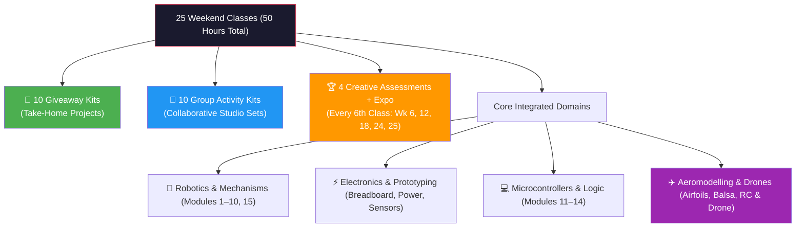
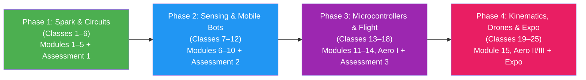

# Good Soil — 25-Class Master STEM & Robotics Curriculum Outline

> **Target Batches:** Junior (Ages 6–9 / Grades 1–4) & Senior (Ages 10–14 / Grades 5–9)  
> **Structure:** 25 Weekend Classes (2 Hours each with 10-min break — 50 Hours Total)  
> **Pedagogical Backbone:** Aligned with the *Good Soil Robotics Curriculum Framework* (Modules 1–15) + *Practiko Multi-Grade Engineering Bundles* + *Indian Aeromodelling & Drone Track*.  
> **Core Architecture:** 10 Giveaway (Take-Home) Kits + 10 Collaborative Group Kits + 4 Gamified Milestone Assessments + 1 Grand Capstone Expo.  
> **Mantra:** *Learn → Play → Build → Compete → Take Home*

---

## 1. Curriculum Architecture & Mix

### Class Distribution Summary

| Class Category | Number of Classes | Description & Pedagogical Purpose |
| :--- | :---: | :--- |
| **🎁 Giveaway (Take-Home) Kits** | **10** | Individual hands-on builds that students assemble, calibrate, keep, and demonstrate at home. |
| **🤝 Group Activity Kits** | **10** | Reusable studio platforms (Practiko Mechatronics, Kinematics, Hydraulics) fostering collaborative problem solving in teams of 4–5. |
| **🏆 Creative Milestone Assessments** | **4** | Every 6th class (Classes 6, 12, 18, 24) converted into gamified challenges, obstacle runs, or tech defense derbies. |
| **🎓 Grand Capstone Expo** | **1** | Class 25 — Grand Exhibition, live flight & robot arena, parent demos, and graduation awards. |
| **Total** | **25** | **Complete 6-Month STEM Odyssey** |

---

## 2. Pedagogical Progression & Foundation Discovery Architecture

### The 2-Tier "Starter & Foundation Discovery" System (120 Minutes)
1. **Foundation & Discovery (20–25 min):** Hands-on exploration of loose components (motors, gears, LDRs, airfoils) and instructor live demo before touching kits.
2. **Guided Project Build (50–55 min):** Step-by-step assembly, circuit wiring on breadboards, and mechanical tuning.
3. **Testing, Challenge & Journal (40–45 min):** Timed runs, parameter measurements, failure troubleshooting, and STEM Passport log entries.

---

## 3. Junior Batch (Ages 6–9 / Grades 1–4) — Complete 25-Class Outline

| Class | Phase | Framework Module | Kit Type | Kit / Activity Name | Key Concept & Learning Outcome |
| :---: | :---: | :--- | :---: | :--- | :--- |
| **01** | P1 | **Module 1: Meet the Robots** | 🤝 Group Kit #1 | **Human vs. Robot Explorer Station** | Robot vs. tool vs. animal; inputs (eyes/ears) vs. outputs (hands/legs). |
| **02** | P1 | **Module 2: Instructions to Robots** | 🤝 Group Kit #2 | **Floor Grid Robot Maze & Code Cards** | Step-by-step algorithms, precise commands, unplugged path finding. |
| **03** | P1 | **Module 3: Components of a Simple Robot**| 🤝 Group Kit #3 | **5 Organs of a Robot Dissection Lab** | Power (Battery), Input (Sensors), Brain, Output (Motors), Body (Chassis). |
| **04** | P1 | **Module 4: BreadBoard — An Introduction**| 🎁 Giveaway #1 | **Junior Snap / Pinboard LED Circuit** | Solderless connections, power rails, completed loops, LED lighting. |
| **05** | P1 | **Module 5: Electricity: Powering a Robot**| 🎁 Giveaway #2 | **Electric Propeller & Aerodynamic Wind Car**| Battery polarity, DC motor spin direction, circuit loops, aerodynamic thrust. |
| **06** | P1 | **🏆 ASSESSMENT 1** | 🎯 Creative Test | **"Mission: Island Escape & Circuit Maze"** | **Gamified Challenge:** Fix a beacon circuit, navigate an unplugged rescue grid, and launch an SOS propeller car. (Badge: *Junior Explorer*) |
| **07** | P2 | **Module 6: Sensors — Part I** | 🎁 Giveaway #3 | **Automatic Night-Glow Sensor Lamp** | Light-dependent resistors (LDR), automatic switching in darkness. |
| **08** | P2 | **Module 7: Sensors & Buzzers — Part II** | 🎁 Giveaway #4 | **Morse Code Telegraph & Buzzer Station** | Sound vibrations, piezo buzzers, Morse code binary communication. |
| **09** | P2 | **Module 8: Sensor & Switches** | 🤝 Group Kit #4 | **2-Way Reversible Motor & Railway Gate** | Pushbuttons, toggle switches, polarity reversal, forward/reverse motion. |
| **10** | P2 | **Module 9: Motors: Making Robots Move** | 🤝 Group Kit #5 | **Mechanical Gearbox & Carousel Machine** | Spur gears, driver vs. driven gears, speed vs. torque transmission. |
| **11** | P2 | **Module 10: Build a Moving Robot** | 🎁 Giveaway #5 | **Junior 2-Wheel Rover Build (Milestone!)** | Full robot integration: chassis, battery, dual DC motors, switch, alignment. |
| **12** | P2 | **🏆 ASSESSMENT 2** | 🎯 Creative Test | **"The Great Rover Derby & Agility Track"**| **Gamified Challenge:** Timed slalom race, gear-ratio torque climbing ramp, and precision stopping. (Badge: *Master Crafter*) |
| **13** | P3 | **Module 11: Intro to Microcontroller** | 🤝 Group Kit #6 | **Micro:bit / Block Brain First Blink** | Robot brains, input/output pins, visual block coding, LED matrix display. |
| **14** | P3 | **Module 12: Microcontroller — Part II** | 🤝 Group Kit #7 | **Interactive Sound & Emotion Display** | Button event triggers, animated facial expressions, sound synthesis. |
| **15** | P3 | **Module 13: Microcontroller Projects** | 🎁 Giveaway #6 | **Smart Security Room Guard / Gate Alarm** | Ultrasonic distance sensing, intruder detection threshold, alarm triggering. |
| **16** | P3 | **Module 14: Loops & Repetition** | 🤝 Group Kit #8 | **Looping Light Patrol & Dancing Bot** | While/repeat loops, continuous automation routines, state transitions. |
| **17** | P3 | **✈️ Aeromodelling Track I** | 🤝 Group Kit #9 | **High-Lift Balsa & Foam Chuck Gliders** | Aerodynamics: Lift, weight, thrust, drag; dihedral angle stability. |
| **18** | P3 | **🏆 ASSESSMENT 3** | 🎯 Creative Test | **"The Sky Patrol & Sensor Beacon Derby"** | **Gamified Challenge:** Longest glide flight contest + landing on a sensor target pad. (Badge: *Flight Cadet*) |
| **19** | P4 | **Module 15: Robot Mechanics — Part I** | 🎁 Giveaway #7 | **Walking Bionic T-Rex / Crab Linkage** | 4-bar linkages, crank mechanisms, converting rotation into walking gait. |
| **20** | P4 | **Robot Mechanics — Part II** | 🎁 Giveaway #8 | **Wooden Catapult & Trajectory Launcher** | Levers, fulcrums, mechanical advantage, projectile trajectory physics. |
| **21** | P4 | **✈️ Aeromodelling Track II** | 🎁 Giveaway #9 | **Rubber-Band Powered High-Endurance Plane**| Propeller pitch, rubber motor energy storage, glide ratio extension. |
| **22** | P4 | **✈️ Aeromodelling Track III** | 🤝 Group Kit #10 | **Mini-Drone Flight Discovery Station** | 4-rotor quadcopter physics, roll/pitch/yaw joystick basics, indoor hover. |
| **23** | P4 | **Clean Energy & Capstone Assembly** | 🎁 Giveaway #10 | **Solar-Powered Eco Rover Car** | Photovoltaic cells, solar-to-electric conversion, student capstone prep. |
| **24** | P4 | **🏆 ASSESSMENT 4** | 🎯 Creative Test | **"Young Inventors Showcase & Pitch Arena"**| **Gamified Challenge:** Pitching customized builds to mentors, explaining circuit diagrams, live test runs. (Badge: *Young Innovator*) |
| **25** | P4 | **🎓 GRAND EXPO** | 🌟 Showcase Day | **Good Soil Junior STEM Expo & Graduation** | Parent demos, live flight show, robot arena challenges, medals & passports. |

---

## 4. Senior Batch (Ages 10–14 / Grades 5–9) — Complete 25-Class Outline

| Class | Phase | Framework Module | Kit Type | Kit / Activity Name | Key Concept & Learning Outcome |
| :---: | :---: | :--- | :---: | :--- | :--- |
| **01** | P1 | **Module 1: Meet the Robots** | 🤝 Group Kit #1 | **Autonomous Systems & DoF Dissection** | Degrees of Freedom (DoF), robotic kinematic chains, Cartesian vs. articulated bots. |
| **02** | P1 | **Module 2: Instructions to Robots** | 🤝 Group Kit #2 | **Pseudocode, State Machines & Flowcharts** | Algorithmic logic, decision branches (IF-THEN-ELSE), state transition diagrams. |
| **03** | P1 | **Module 3: Components of a Simple Robot**| 🤝 Group Kit #3 | **Hardware BOM & Signal Routing Lab** | Circuit schematics, digital vs. analog signaling, power bus routing. |
| **04** | P1 | **Module 4: BreadBoard — An Introduction**| 🎁 Giveaway #1 | **Half-Size Solderless Breadboard Lab** | Power rails, 5V/GND bus discipline, tie-points, jumper wiring techniques. |
| **05** | P1 | **Module 5: Electricity: Powering a Robot**| 🎁 Giveaway #2 | **Multi-Voltage Power Supply & Test Station** | Ohm’s Law ($V = I \times R$), series vs. parallel cells, multimeter voltage drop & current draw. |
| **06** | P1 | **🏆 ASSESSMENT 1** | 🎯 Creative Test | **"The Circuit Diagnostics & Bug Hackathon"**| **Gamified Challenge:** Troubleshoot intentionally injected breadboard wiring bugs & calculate loads. (Badge: *Apprentice Engineer*) |
| **07** | P2 | **Module 6: Sensors — Part I** | 🎁 Giveaway #3 | **Precision LDR Light Sensor & Divider Bench**| Voltage divider equation, analog light sensing, pull-up/pull-down resistor calibration. |
| **08** | P2 | **Module 7: Sensors & Buzzers — Part II** | 🎁 Giveaway #4 | **Transistor-Driven Piezo Alarm Circuit** | Transistors as digital switches (NPN 2N2222), driving higher loads, audio signaling. |
| **09** | P2 | **Module 8: Sensor & Switches** | 🤝 Group Kit #4 | **Relay Logic & Reversible DPDT Motor Drive**| DPDT switch H-bridge emulation, electromechanical relays, machine limit stops. |
| **10** | P2 | **Module 9: Motors: Making Robots Move** | 🤝 Group Kit #5 | **Dual-Motor Gear Ratio & Speed/Torque Bench**| Spur & worm gears, gear ratio math ($N_1/N_2$), stall torque vs. RPM curves, motor drivers. |
| **11** | P2 | **Module 10: Build a Moving Robot** | 🎁 Giveaway #5 | **4WD Heavy-Duty Obstacle Rover Chassis** | Full mechanical build: dual gearmotors, battery rack, rocker switch, chassis alignment. |
| **12** | P2 | **🏆 ASSESSMENT 2** | 🎯 Creative Test | **"The Autonomous Rescue Rover Challenge"** | **Gamified Challenge:** Negotiate incline obstacle ramps, payload stability, docking maneuvers. (Badge: *Systems Builder*) |
| **13** | P3 | **Module 11: Intro to Microcontroller** | 🤝 Group Kit #6 | **Arduino / Microcontroller Embedded Core** | Microcontroller architecture, GPIO pins, firmware upload, writing C++/Block code. |
| **14** | P3 | **Module 12: Microcontroller — Part II** | 🤝 Group Kit #7 | **Analog Read & PWM Motor Speed Control** | Pulse Width Modulation (PWM), 8-bit duty cycles, modulating motor speed via sensor input. |
| **15** | P3 | **Module 13: Microcontroller Projects** | 🎁 Giveaway #6 | **Ultrasonic Radar Distance & Collision Guard**| Speed-of-sound echo timing, obstacle detection algorithms, collision avoidance signaling. |
| **16** | P3 | **Module 14: Loops & Repetition** | 🤝 Group Kit #8 | **State Machines & Edge-Avoiding Autonomy** | Non-blocking timed loops (`millis()`), finite state machines, algorithmic evasive patrol. |
| **17** | P3 | **✈️ Aeromodelling Track I** | 🤝 Group Kit #9 | **Aeronautical Airfoils & Large Balsa Glider** | Airfoil geometry (camber, chord), lift/drag polar curves, aerodynamic stall, glide tuning. |
| **18** | P3 | **🏆 ASSESSMENT 3** | 🎯 Creative Test | **"Avionics & Sensor Radar Arena Trial"** | **Gamified Challenge:** Calibrate an ultrasonic detection grid + 15-meter stable glider flight. (Badge: *Avionics Specialist*) |
| **19** | P4 | **Module 15: Robot Mechanics — Part I** | 🤝 Group Kit #10| **Kinematics: Linkages, JCB & Slider-Cranks** | Grashof’s criteria, 4-bar linkages, slider-crank mechanisms, JCB excavator arm assembly. |
| **20** | P4 | **Robot Mechanics — Part II** | 🎁 Giveaway #7 | **Hydraulic Mech Gripper Robot Arm** | Pascal’s Law ($P = F/A$), hydraulic fluid pressure, master/slave syringe circuits, gripper claw. |
| **21** | P4 | **✈️ Aeromodelling Track II** | 🎁 Giveaway #8 | **Motorized Electric DIY Aircraft** | Thrust-to-weight ratio ($T/W > 1$), coreless motor efficiency, LiPo discharge curves. |
| **22** | P4 | **✈️ Aeromodelling Track III** | 🎁 Giveaway #9 | **BrainHap Quadcopter Flight & Telemetry** | Counter-rotating rotors, gyro stabilization, yaw/pitch/roll PID control concepts. |
| **23** | P4 | **Advanced IoT & Capstone Integration** | 🎁 Giveaway #10 | **Smart Connected IoT Rover / Weather Node** | Integrating sensors, telemetry, and motor control into the student capstone platform. |
| **24** | P4 | **🏆 ASSESSMENT 4** | 🎯 Creative Test | **"Good Soil Shark Tank & Capstone Defense"**| **Gamified Challenge:** Defending circuit diagrams, explaining iterations, live autonomous demo. (Badge: *Master Innovator*) |
| **25** | P4 | **🎓 GRAND EXPO** | 🌟 Showcase Day | **Good Soil Senior Tech Symposium & Graduation** | Public live flight exhibitions, robotics battle arena, project displays, medals & diplomas. |
