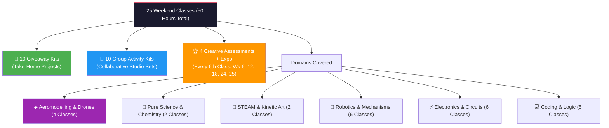
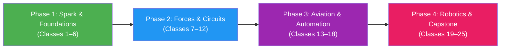
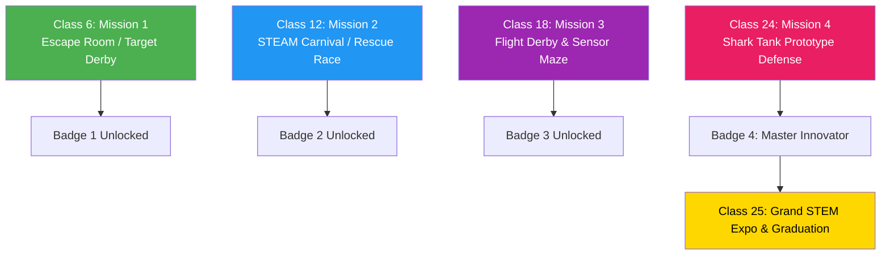

# Good Soil — 25-Class Master STEM Curriculum Plan

> **Target Batches:** Junior (Ages 5–9) & Senior (Ages 10–16)  
> **Cadence:** 25 Weekend Classes (2 Hours each with 10-min break)  
> **Core Architecture:** 10 Giveaway Kits + 10 Collaborative Group Kits + 4 Aeromodelling & Drone Masterclasses + 2 Pure Science/Chemistry Deep-Dives + STEAM Art Integration + Gamified Creative Assessments every 6th class (Classes 6, 12, 18, 24) + Grand Capstone Expo (Class 25).  
> **Mantra:** *Learn → Play → Build → Compete → Take Home*

---

## 1. Structural Breakdown (The 25 Classes)



### Class Distribution Summary

| Class Category | Number of Classes | Description & Pedagogical Purpose |
| :--- | :---: | :--- |
| **🎁 Giveaway (Take-Home) Kits** | **10** | Individual hands-on builds that students keep, test at home, and share with parents. |
| **🤝 Group Activity Kits** | **10** | Advanced, collaborative studio kits (teams of 4–5) promoting peer problem solving, larger assemblies, and teamwork. |
| **🏆 Creative Milestone Assessments** | **4** | Every 6th class (Classes 6, 12, 18, 24) converted into gamified challenges, escape quests, or derby competitions. |
| **🎓 Grand Capstone Expo** | **1** | Class 25 — Grand Exhibition, live flight & robot arena, parent demos, and graduation awards. |
| **Total** | **25** | **Complete 6-Month STEM Odyssey** |

---

## 2. Pedagogical Progression & Foundation Discovery Architecture



### The 2-Tier "Starter & Foundation Discovery" System
To ensure students do not just blindly follow assembly steps, **every domain kickoff session integrates an active 10–30 minute "Foundation & Component Discovery" segment** before opening the main project kit:

```
┌──────────────────────────────────────────────────────────────────────────────┐
│  SESSION TIME ALLOCATION (120 Minutes Total)                                 │
├──────────────────────────┬───────────────────────┬───────────────────────────┤
│  1. Foundation & Starter │  2. Guided Project    │  3. Testing, Challenge &  │
│     Discovery (15–30 min)│     Build (45–50 min) │     Journal (30–40 min)   │
│  ──────────────────────  │  ───────────────────  │  ───────────────────────  │
│  • Touch & test loose    │  • Individual/Group   │  • Measure, race, record  │
│    components (motors,   │    assembly of the    │  • STEAM extension &      │
│    LEDs, gears, airfoils)│    selected kit       │    troubleshooting        │
│  • Instructor live demo  │  • Step-by-step logic │  • STEM Passport log entry│
└──────────────────────────┴───────────────────────┴───────────────────────────┘
```

#### Junior Batch Foundation Discovery (10–20 min):
* **Tactile & Visual:** "Meet the Component" show-and-tell with giant visual cards and large touchable sample parts (e.g., spinning motor shaft, blinking LED with coin cell, interlocking spur gears).
* **Interactive Test Bench:** Simple snap-circuit or alligator-lead tester where kids verify if parts work before building.

#### Senior Batch Foundation Discovery (20–30 min):
* **Engineering & Schematics:** Circuit breadboarding, multimeter continuity/voltage checks, analyzing sensor datasheets (e.g. sound sensor threshold, strain gauge resistance curves), and understanding free-body diagrams / center-of-gravity vectors.
* **Component Diagnostics:** Troubleshooting simulations (e.g., "Why won't this motor reverse? Let's trace the DPDT switch polarity").

---

## 3. Junior Batch (Ages 7–10 / Grades 2–5) — Complete 25-Class Outline

> **Pedagogical Focus:** For young engineers ages 7 to 10. Every single class involves hands-on mechanical builds, motorized circuits, aerodynamics, chemical reactions, optics, and bionic robotics. (Preschool tracing/letter books are excluded and kept only as optional kindergarten kits).

| Class | Phase | Theme & Domain | Kit Type | Kit / Activity Name | Key Concept & Learning Outcome |
| :---: | :---: | :--- | :---: | :--- | :--- |
| **01** | P1 | ⚡ **Electricity & Aero** | 🎁 Giveaway #1 | **Electric Propeller & Aerodynamic Wind Car** | Motor circuit polarity, thrust generation, aerodynamic propulsion. |
| **02** | P1 | ✈️ **Aeromodelling I** | 🤝 Group Kit #1 | **High-Lift Paper Gliders & Airfoil Launcher** | Wing shapes, launch angles, thrust vs. drag basics. |
| **03** | P1 | 🧪 **Science Deep-Dive I** | 🤝 Group Kit #2 | **Kitchen Chemistry & Color Fireworks Lab** | Acid-base reactions, density layers, fizzing chemistry. |
| **04** | P1 | ⚙️ **Mechanics I** | 🎁 Giveaway #2 | **Wooden Catapult & Trajectory Shooter** | Levers, fulcrums, stored potential energy to kinetic motion. |
| **05** | P1 | 🎨 **STEAM & Art I** | 🎁 Giveaway #3 | **Motorized Spin-Art & Centrifugal Machine** | Centrifugal force, rotational dynamics, symmetry & kinetic art. |
| **06** | P1 | 🏆 **ASSESSMENT 1** | 🎯 Creative Test | **"The Young Inventor's Island Escape"** | **Gamified Challenge:** Build an escape raft using floatation concepts & catapult messages over obstacle walls. (Badge: *Junior Explorer*) |
| **07** | P2 | ⚙️ **Mechanics II** | 🎁 Giveaway #4 | **Wooden Paddle Steamer Propeller Boat** | Water resistance, paddle propulsion, rotational energy. |
| **08** | P2 | ✈️ **Aeromodelling II** | 🤝 Group Kit #3 | **Balsa/Foam Chuck Glider & Flight Tuning** | Center of gravity (CG), dihedral angles, stable gliding. |
| **09** | P2 | ⚡ **Electricity I** | 🎁 Giveaway #5 | **Wooden Glow Table Lamp & Switch Circuit** | Open vs. closed circuits, LED polarity, conductors. |
| **10** | P2 | ⚙️ **Mechanics III** | 🤝 Group Kit #4 | **Wooden Mechanical Carousel & Gear Train** | Gear ratios, speed vs. torque, clockwise/counter-clockwise. |
| **11** | P2 | ⚡ **Electronics & Art** | 🎁 Giveaway #6 | **Morse Code Telegraph & Buzzer Sounder** | Electromagnets, circuit continuity, binary signaling & Morse code. |
| **12** | P2 | 🏆 **ASSESSMENT 2** | 🎯 Creative Test | **"The STEAM Carnival Challenge"** | **Gamified Challenge:** Teams build a mini amusement park ride with gear motors & light signals. Peer voting & tickets. (Badge: *Master Crafter*) |
| **13** | P3 | ✈️ **Aeromodelling III** | 🎁 Giveaway #7 | **Air-Powered Pneumatic Rocket Launcher** | Air compression, pneumatic force, launch range optimization. |
| **14** | P3 | ⚡ **Electricity II** | 🤝 Group Kit #5 | **10-in-1 Ultimate Electricity Lab** | Series vs. parallel circuits, buzzers, magnetic switches. |
| **15** | P3 | 💻 **Coding & Logic I** | 🎁 Giveaway #8 | **Mechanical Secret Cipher Wheel & Maze** | Cryptography, pattern recognition, algorithmic thinking. |
| **16** | P3 | 🌌 **Space Science** | 🤝 Group Kit #6 | **3-Ball Motorized Sun, Earth & Moon Model** | Planetary rotation, lunar phases, day/night cycles. |
| **17** | P3 | 🔬 **Science Deep-Dive II**| 🎁 Giveaway #9 | **Pin Hole Camera & Reflection Periscope** | Light ray propagation, inverted images, periscope mirrors. |
| **18** | P3 | 🏆 **ASSESSMENT 3** | 🎯 Creative Test | **"The Sky & Signals Derby"** | **Gamified Challenge:** Precision rocket landing contest + decoding Morse light signals sent across the classroom. (Badge: *Flight Cadet*) |
| **19** | P4 | 🤖 **Robotics I** | 🤝 Group Kit #7 | **Wooden Walking T-Rex Bionic Robot** | Crank mechanisms, 4-bar linkage walking gait. |
| **20** | P4 | 🤖 **Robotics II** | 🤝 Group Kit #8 | **Electric Coin-Eating Smart Bank Robot** | Switch automation, mechanical jaws, smart triggering. |
| **21** | P4 | ⚡ **Clean Energy** | 🎁 Giveaway #10 | **Wooden Solar Power Rover Car** | Photovoltaic cells, solar energy to motor rotation. |
| **22** | P4 | 🤖 **Robotics III** | 🤝 Group Kit #9 | **Two-Wheeled Obstacle Rover Team Build** | Chassis balance, high-speed dual motor drive. |
| **23** | P4 | ✈️ **Aeromodelling IV** | 🤝 Group Kit #10 | **Drone Flight Discovery & Mini Quad Pilot** | Drone anatomy, 4-rotor aerodynamics, safe pilot station. |
| **24** | P4 | 🏆 **ASSESSMENT 4** | 🎯 Creative Test | **"The Future City Innovation Pitch"** | **Gamified Challenge:** Teams combine 2+ mechanisms into a "Smart City" gadget and pitch to mentors. (Badge: *Young Innovator*) |
| **25** | P4 | 🎓 **GRAND EXPO** | 🌟 Showcase Day | **Good Soil Junior Innovators Expo & Graduation** | Parent demos, live robot racing, flight exhibitions, graduation medals & STEM passports. |

---

## 4. Senior Batch (Ages 10–16) — Complete 25-Class Outline

| Class | Phase | Theme & Domain | Kit Type | Kit / Activity Name | Key Concept & Learning Outcome |
| :---: | :---: | :--- | :---: | :--- | :--- |
| **01** | P1 | ⚙️ **Mechanics I** | 🎁 Giveaway #1 | **Hydraulic Mech Gripper Robot Arm** | Pascal’s law, fluid pressure transmission, mechanical advantage. |
| **02** | P1 | ✈️ **Aeromodelling I** | 🤝 Group Kit #1 | **Rubber-Band High-Endurance Monoplane** | Airfoil aerodynamics, dihedral stability, propeller pitch. |
| **03** | P1 | 🧪 **Science Deep-Dive I** | 🤝 Group Kit #2 | **150+ Chemistry & Physics Experiment Lab** | Exothermic/endothermic reactions, pH titration, crystal growth. |
| **04** | P1 | ⚙️ **Mechanics II** | 🎁 Giveaway #2 | **Precision Force Vector Catapult & Target** | Projectile physics, parabolic trajectory, angle math. |
| **05** | P1 | 🎨 **STEAM & Art I** | 🎁 Giveaway #3 | **SolarGlide Kinetic Solar Aircraft Mobile** | Photovoltaic power, balance point physics, kinetic sculpture. |
| **06** | P1 | 🏆 **ASSESSMENT 1** | 🎯 Creative Test | **"The Medieval Siege & Chemistry Hackathon"** | **Gamified Challenge:** Target hit accuracy competition using catapult math + chemical indicator color puzzle. (Badge: *Apprentice Engineer*) |
| **07** | P2 | ⚡ **Electronics I** | 🎁 Giveaway #4 | **DIY Electronic Weighing Scale (Strain Sensor)** | Resistance variation, sensor calibration, digital display logic. |
| **08** | P2 | ✈️ **Aeromodelling II** | 🤝 Group Kit #3 | **Large-Wingspan Foam Glider & CG Balancing** | Aerodynamic stalling, glide ratio calculation, trim adjustments. |
| **09** | P2 | ⚡ **Electronics II** | 🎁 Giveaway #5 | **2-Way Reversible Motor Electric Car** | DPDT switch polarity reversal, motor torque, wheel traction. |
| **10** | P2 | ⚙️ **Mechanics III** | 🤝 Group Kit #4 | **Heavy-Duty Cable Car Overhead Lift System** | Pulleys, mechanical tension, gear reduction, cable suspension. |
| **11** | P2 | 🎨 **STEAM & Art II** | 🎁 Giveaway #6 | **Neon Glow Optical Infinity Mirror** | Semi-transparent mirrors, infinite reflection geometry, LED matrix. |
| **12** | P2 | 🏆 **ASSESSMENT 2** | 🎯 Creative Test | **"The Autonomous Rescue Rover Challenge"** | **Gamified Challenge:** Build a cable-driven or mobile rover capable of crossing an obstacle canyon and retrieving cargo. (Badge: *Systems Builder*) |
| **13** | P3 | ✈️ **Aeromodelling III** | 🎁 Giveaway #7 | **Motorized Electric DIY Aircraft (Pludo)** | Propeller thrust-to-weight ratio, battery drain curves, powered flight. |
| **14** | P3 | ⚙️ **Mechanics IV** | 🤝 Group Kit #5 | **Motorized Forklift & Heavy Cargo Lifter** | Worm gears, non-reversing gearboxes, rack & pinion lifts. |
| **15** | P3 | 💻 **Coding & Sensors I**| 🎁 Giveaway #8 | **Clap-Racer Sound-Activated Car** | Sound sensor triggers, transistor switching, latching circuits. |
| **16** | P3 | 🌌 **Space Tech** | 🤝 Group Kit #6 | **Orbital Satellite & Telemetry Antenna Model** | Satellite communications, telemetry orbits, solar array alignment. |
| **17** | P3 | 🔬 **Science Deep-Dive II**| 🎁 Giveaway #9 | **Infinity Curve & Harmonic Motion Pendulum** | Harmonic resonance, damping forces, conservation of momentum. |
| **18** | P3 | 🏆 **ASSESSMENT 3** | 🎯 Creative Test | **"The Aeromodelling Flight Derby & Sensor Arena"** | **Gamified Challenge:** Longest flight duration contest + acoustic sound-trigger time trial obstacle race. (Badge: *Avionics Specialist*) |
| **19** | P4 | 🤖 **Robotics I** | 🤝 Group Kit #7 | **Multi-Axis Motorized Robotic Claw Machine** | 3-axis motion, stepper/servo actuation, end-effector gripping. |
| **20** | P4 | 🤖 **Robotics II** | 🤝 Group Kit #8 | **Bujji Autonomous Obstacle-Avoiding Robot** | Ultrasonic distance sensing, microcontroller decision trees. |
| **21** | P4 | 💻 **Coding & Logic II**| 🎁 Giveaway #10 | **Programmable Motorized Arrow Launcher** | Micro-switch timing, rapid firing mechanisms, safe launch triggers. |
| **22** | P4 | 🤖 **Robotics III** | 🤝 Group Kit #9 | **Moto-Bot Bionic Multi-Leg Walker** | Klann/Jansen linkage systems, biomimetic multi-leg locomotion. |
| **23** | P4 | ✈️ **Aeromodelling IV** | 🤝 Group Kit #10 | **BrainHap HD Camera Drone Piloting & Telemetry**| Quadcopter roll/pitch/yaw aerodynamics, aerial photography, altitude hold. |
| **24** | P4 | 🏆 **ASSESSMENT 4** | 🎯 Creative Test | **"The Good Soil Shark Tank & Capstone Defense"** | **Gamified Challenge:** Teams defend their customized robotic/drone prototype, explain circuit diagrams, and showcase live demos to judges. (Badge: *Master Innovator*) |
| **25** | P4 | 🎓 **GRAND EXPO** | 🌟 Showcase Day | **Good Soil Senior Tech Symposium & Graduation** | Public live flight exhibitions, robotics battle arena, project display tables, certification & trophy ceremony. |

---

## 5. The Creative Assessment Framework (Every 6th Class)



### Assessment Rubric (Scored Out of 100 Points per Mission)

1. **Engineering Execution (30 Pts):** Does the mechanism/circuit work smoothly without jamming or short-circuiting?
2. **Scientific Explanation (25 Pts):** Can the student explain *why* it works (e.g., "The gear ratio reduces speed to increase torque")?
3. **Troubleshooting & Iteration (20 Pts):** When something failed during testing, how did they fix it?
4. **Creativity & STEAM Customization (15 Pts):** Aesthetic finish, custom modifications, or innovative add-ons.
5. **Team Collaboration & Communication (10 Pts):** Peer support, role sharing, and presentation clarity.

---

## 6. Procurement & Logistics Matrix

### Kit Inventory Strategy

* **Giveaway Kits (10 Kits per Student):**
  * 30 Junior students × 10 kits = **300 units**
  * 30 Senior students × 10 kits = **300 units**
  * *Total Take-Home Units:* **600 units**
* **Group Activity Kits (10 Kits per Age Group):**
  * 10 unique group kits × 3 units (1 unit per 5 students in a 15-student batch) = **30 units for Junior**
  * 10 unique group kits × 3 units = **30 units for Senior**
  * *Total Collaborative Studio Units:* **60 units** (reused across Saturday & Sunday batches!)
* **Total Physical Inventory:** 660 total kit packages across 6 months.

---

## 7. Master Budget Sheets & BOM Files

The full itemized Bill of Materials (BOM) with exact quantities, vendor SKUs, and unit pricing is generated and stored at:

* 📊 **Excel Workbook:** [`Budget/GoodSoil_Phase1_Kit_Procurement_BOM.xlsx`](file:///c:/Users/vizzu/Desktop/Good%20Soil/Budget/GoodSoil_Phase1_Kit_Procurement_BOM.xlsx)
* 📑 **Markdown Sheet:** [`Budget/GoodSoil_Phase1_Kit_Procurement_BOM.md`](file:///c:/Users/vizzu/Desktop/Good%20Soil/Budget/GoodSoil_Phase1_Kit_Procurement_BOM.md)

### Budget Summary by Model

| Model | Junior (30 Kids) | Senior (30 Kids) | Teacher & Lab Assets | Total Budget | Operational Notes |
| :--- | :---: | :---: | :---: | :---: | :--- |
| **Model A: Shared Studio Sets** *(3 Units/Kit)* | ₹28,500 | ₹46,500 | ₹11,000 | **~₹86,000** | Aligned with ₹75K–80K Mission Deck. Reusable studio kits. |
| **Model B: Full Take-Home** *(10 Kits/Kid)* | ₹1,55,000 | ₹2,24,000 | ₹18,000 | **~₹3,97,000** | Aligned with ₹4K–6K (Jr) and ₹6K–8K (Sr) student fee model. |
| **Model C: Bulk Negotiated Take-Home** | **₹1,27,000** | **₹1,83,000** | **₹14,500** | **~₹3,24,500** | **Recommended Target** (18% avg institutional discount for 600+ units). |

