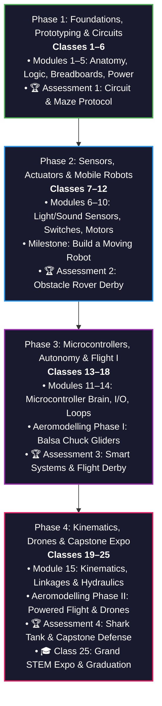
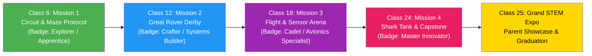

# Good Soil — 25-Class Master STEM & Robotics Curriculum Plan

> **Target Batches:** Junior (Ages 6–9 / Grades 1–4) & Senior (Ages 10–14 / Grades 5–9)  
> **Cadence:** 25 Weekend Classes (2 Hours each with 10-min break — 50 Hours Total)  
> **Pedagogical Backbone:** Aligned with the *Good Soil Robotics Curriculum Framework* (Modules 1–15) + *Practiko Multi-Grade Engineering Bundles* + *Indian Aeromodelling & Drone Track*.  
> **Structure:** 10 Take-Home Giveaway Kits + 10 Collaborative Studio Group Kits + 4 Gamified Milestone Assessments + 1 Grand Capstone Expo.  
> **Mantra:** *Learn → Play → Build → Compete → Take Home*

---

## 1. Curriculum Architecture & Modular Flow

The 25-class syllabus follows a **first-principles engineering progression**. Instead of building isolated toy kits, every module introduces a fundamental layer of robotics and engineering that connects directly to the next:


```mermaid
graph TD
    P1["Phase 1: Foundations, Prototyping & Circuits<br/><b>Classes 1–6</b><br/>• Modules 1–5: Anatomy, Logic, Breadboards, Power<br/>• 🏆 Assessment 1: Circuit & Maze Protocol"]
    P2["Phase 2: Sensors, Actuators & Mobile Robots<br/><b>Classes 7–12</b><br/>• Modules 6–10: Light/Sound Sensors, Switches, Motors<br/>• Milestone: Build a Moving Robot<br/>• 🏆 Assessment 2: Obstacle Rover Derby"]
    P3["Phase 3: Microcontrollers, Autonomy & Flight I<br/><b>Classes 13–18</b><br/>• Modules 11–14: Microcontroller Brain, I/O, Loops<br/>• Aeromodelling Phase I: Balsa Chuck Gliders<br/>• 🏆 Assessment 3: Smart Systems & Flight Derby"]
    P4["Phase 4: Kinematics, Drones & Capstone Expo<br/><b>Classes 19–25</b><br/>• Module 15: Kinematics, Linkages & Hydraulics<br/>• Aeromodelling Phase II: Powered Flight & Drones<br/>• 🏆 Assessment 4: Shark Tank & Capstone Defense<br/>• 🎓 Class 25: Grand STEM Expo & Graduation"]

    P1 --> P2
    P2 --> P3
    P3 --> P4

    style P1 fill:#1a1a2e,color:#fff,stroke:#4CAF50,stroke-width:2px
    style P2 fill:#1a1a2e,color:#fff,stroke:#2196F3,stroke-width:2px
    style P3 fill:#1a1a2e,color:#fff,stroke:#9C27B0,stroke-width:2px
    style P4 fill:#1a1a2e,color:#fff,stroke:#E91E63,stroke-width:2px
```

### Class Distribution Summary

| Class Category | Number of Classes | Format & Pedagogical Purpose |
| :--- | :---: | :--- |
| **🎁 Giveaway (Take-Home) Kits** | **10** | Individual builds that students construct, calibrate, take home, and demonstrate to parents. |
| **🤝 Studio Group Activity Kits** | **10** | Reusable multi-component systems (Practiko Mechatronics, Kinematics, Hydraulics) fostering teamwork in teams of 4–5. |
| **🏆 Creative Milestone Assessments** | **4** | Gamified team challenges every 6th class (Classes 6, 12, 18, 24) to validate conceptual mastery without paper exams. |
| **🎓 Grand Capstone Expo** | **1** | Class 25: Public flight arena, live robot racing, parent demos, certification, and STEM passport graduation. |
| **Total** | **25** | **Complete 6-Month STEM Odyssey (50 Class Hours)** |

---

## 2. Session Architecture: The 2-Tier Discovery Model

Every 120-minute class follows an intentional 3-stage flow ensuring deep conceptual retention before building:

```
┌─────────────────────────────────────────────────────────────────────────────────────────────┐
│  SESSION TIME ALLOCATION (120 Minutes Total)                                                │
├───────────────────────────────┬──────────────────────────────┬──────────────────────────────┤
│  1. Starter & Discovery       │  2. Guided Project Build     │  3. Testing, Challenge &     │
│     (20–25 min)               │     (50–55 min)              │     STEM Passport (40–45 min)│
├───────────────────────────────┼──────────────────────────────┼──────────────────────────────┤
│  • Touch loose components     │  • Step-by-step assembly     │  • Benchmark speed/distance  │
│  • Live instructor demo       │  • Solderless breadboarding  │  • Troubleshooting clinic    │
│  • Hypothesis testing         │  • Individual / Team build   │  • Passport reflection entry │
└───────────────────────────────┴──────────────────────────────┴──────────────────────────────┘
```

* **Junior Batch (Ages 6–9):** Tactile, visual, snap/magnetic modules, physical cards, and macroscopic gears.
* **Senior Batch (Ages 10–14):** Half-size solderless breadboards, discrete components, resistor color codes, multimeter diagnostics, and code logic.

---

## 3. Junior Batch (Ages 6–9 / Grades 1–4) — Complete 25-Class Syllabus

| Class | Phase | Framework Module | Format | Kit / Activity Name | Practiko / Good Soil Hardware Base | Key Concept & Learning Outcome |
|:---:|:---:|:---|:---:|:---|:---|:---|
| **01** | P1 | **Module 1: Meet the Robots** | 🤝 Studio Group #1 | **Human vs. Robot Explorer Station** | Practiko Mechatronics / Bionic Demo | Difference between tools, automated machines, and autonomous robots; sensory organs vs. robot sensors. |
| **02** | P1 | **Module 2: Instructions to Robots** | 🤝 Studio Group #2 | **Floor Grid Robot Maze & Code Cards** | Unplugged Algorithm Mat + Practiko Logic | Step-by-step sequencing, commands, debugging a path, and algorithmic thinking without screens. |
| **03** | P1 | **Module 3: Components of a Simple Robot** | 🤝 Studio Group #3 | **The 5 Organs of a Robot Dissection Lab** | Practiko Tinkering / Electrical Circuit Lab | Anatomy of a robot: Power (Battery), Input (Sensors), Brain (Controller), Output (Actuators), Body (Chassis). |
| **04** | P1 | **Module 4: BreadBoard — An Introduction** | 🎁 Giveaway #1 | **Junior Snap / Pinboard LED Circuit** | Good Soil Modular Starter Pinboard | How electric connections work without soldering; power rails, closed loops, and lighting LEDs. |
| **05** | P1 | **Module 5: Electricity: Powering a Robot** | 🎁 Giveaway #2 | **Electric Propeller & Aerodynamic Wind Car** | Pludo / Good Soil Aero-Drive Kit | Battery polarity, DC motor spin direction, open vs. closed circuits, thrust generation. |
| **06** | P1 | **🏆 ASSESSMENT 1** | 🎯 Creative Test | **"Mission: Island Escape & Circuit Maze"** | Gamified Challenge Mat (Badge: *Junior Explorer*) | **Challenge:** Fix a broken light beacon circuit, navigate an unplugged rescue grid, and launch an SOS propeller car. |
| **07** | P2 | **Module 6: Sensors — Part I** | 🎁 Giveaway #3 | **Automatic Night-Glow Sensor Lamp** | Practiko / Good Soil LDR Light Kit | How robots "see": Photoresistors (LDR), light vs. darkness resistance changes, automated triggering. |
| **08** | P2 | **Module 7: Sensors & Buzzers — Part II** | 🎁 Giveaway #4 | **Morse Code Telegraph & Buzzer Station** | Good Soil Buzzer & Key Sounder | How robots "speak": Piezo buzzers, sound vibrations, binary sound signals, emergency alarms. |
| **09** | P2 | **Module 8: Sensor & Switches** | 🤝 Studio Group #4 | **2-Way Reversible Motor & Railway Gate** | Practiko Mechatronics (2-Way Switch / Gate) | Push buttons, toggle switches, polarity reversal, motor forward/reverse motion control. |
| **10** | P2 | **Module 9: Motors: Making Robots Move** | 🤝 Studio Group #5 | **Mechanical Gearbox & Carousel Machine** | Practiko Kinematics / Kiddale Gear Train | Spur gears, driver vs. driven gears, speed vs. torque, clockwise/counter-clockwise transmission. |
| **11** | P2 | **Module 10: Build a Moving Robot** | 🎁 Giveaway #5 | **Junior 2-Wheel Rover Build (Milestone!)** | Good Soil Dual-Motor Rover Kit | Full robot integration: chassis, battery box, toggle switch, dual DC motors, and wheel alignment. |
| **12** | P2 | **🏆 ASSESSMENT 2** | 🎯 Creative Test | **"The Great Rover Derby & Agility Track"** | Speed & Obstacle Arena (Badge: *Master Crafter*) | **Challenge:** Time trial race through a slalom course, gear-ratio torque climbing ramp, and precision stopping. |
| **13** | P3 | **Module 11: Intro to Microcontroller** | 🤝 Studio Group #6 | **Micro:bit / Block Brain First Blink** | Practiko / Micro:bit Starter Station | Introducing the "robot brain"; inputs/outputs, programming icons, and uploading the first LED animation. |
| **14** | P3 | **Module 12: Microcontroller — Part II** | 🤝 Studio Group #7 | **Interactive Sound & Emotion Display** | Practiko Mechatronics (Smart Light / OLED) | Triggering sound tones and facial expressions based on touch and button inputs. |
| **15** | P3 | **Module 13: Microcontroller Projects** | 🎁 Giveaway #6 | **Smart Security Room Guard / Gate Alarm** | Good Soil Ultrasonic / Motion Alarm Kit | Assembling an automated room intrusion alarm using sensor thresholds. |
| **16** | P3 | **Module 14: Loops & Repetition** | 🤝 Studio Group #8 | **Looping Light Patrol & Dancing Bot** | Practiko Mechatronics Block Logic | While loops, repeating routines, creating automated continuous behaviors without restarting. |
| **17** | P3 | **✈️ Aeromodelling Track I** | 🤝 Studio Group #9 | **High-Lift Balsa & Foam Chuck Gliders** | Crossvind / Indian Aero Fun Chuck Glider | Principles of flight: Lift, Weight, Thrust, Drag; center of gravity (CG), dihedral wing stability. |
| **18** | P3 | **🏆 ASSESSMENT 3** | 🎯 Creative Test | **"The Sky Patrol & Sensor Beacon Derby"** | Flight Zone & Alarm Test (Badge: *Flight Cadet*) | **Challenge:** Longest glide distance challenge + deploying an automated audio-visual beacon on landing. |
| **19** | P4 | **Module 15: Robot Mechanics — Part I** | 🎁 Giveaway #7 | **Walking Bionic T-Rex / Crab Linkage** | Good Soil / Practiko Bionic Walker Kit | Cranks, 4-bar linkages, converting rotational motor motion into rhythmic walking legs. |
| **20** | P4 | **Robot Mechanics — Part II** | 🎁 Giveaway #8 | **Wooden Catapult & Trajectory Launcher** | Practiko Mechanics / Wooden Levers | Levers, fulcrums, mechanical advantage, elastic potential energy to kinetic motion. |
| **21** | P4 | **✈️ Aeromodelling Track II** | 🎁 Giveaway #9 | **Rubber-Band Powered High-Endurance Plane** | Good Soil Aero Rubber-Motor Monoplane | Propeller pitch, rubber motor energy storage, extended flight glide ratios. |
| **22** | P4 | **✈️ Aeromodelling Track III** | 🤝 Studio Group #10 | **Mini-Drone Flight Discovery Station** | Indoor Safe Ducted Drone Bench | 4-rotor quadcopter physics, roll/pitch/yaw joystick controls, altitude hover dynamics. |
| **23** | P4 | **Clean Energy & Capstone Assembly** | 🎁 Giveaway #10 | **Solar-Powered Eco Rover Car** | Good Soil Photovoltaic Rover Kit | Photovoltaic cells, renewable power, final integration of student capstone showcase models. |
| **24** | P4 | **🏆 ASSESSMENT 4** | 🎯 Creative Test | **"Young Inventors Showcase & Pitch Arena"** | Pitch & Demo Arena (Badge: *Young Innovator*) | **Challenge:** Teams demonstrate their customized robotic/flight build, explain how it works, and defend design choices. |
| **25** | P4 | **🎓 GRAND EXPO** | 🌟 Showcase Day | **Good Soil Junior STEM Expo & Graduation** | Grand Arena & Parent Exhibition | Live robot demonstration arena, glider showcase, medal award ceremony, and STEM Passport certification. |

---

## 4. Senior Batch (Ages 10–14 / Grades 5–9) — Complete 25-Class Syllabus

| Class | Phase | Framework Module | Format | Kit / Activity Name | Practiko / Good Soil Hardware Base | Key Concept & Learning Outcome |
|:---:|:---:|:---|:---:|:---|:---|:---|
| **01** | P1 | **Module 1: Meet the Robots** | 🤝 Studio Group #1 | **Autonomous Systems & DoF Dissection** | Practiko Mechatronics (Robotics Overview) | Degrees of Freedom (DoF), robotic kinematic chains, Cartesian vs. articulated industrial architectures. |
| **02** | P1 | **Module 2: Instructions to Robots** | 🤝 Studio Group #2 | **Pseudocode, State Machines & Flowcharts** | Practiko AI Kit (Algorithm Design) | Algorithmic logic, decision branches (IF-THEN-ELSE), state transition diagrams for autonomous systems. |
| **03** | P1 | **Module 3: Components of a Simple Robot** | 🤝 Studio Group #3 | **Hardware BOM & Signal Routing Lab** | Practiko Electrical Science / Schematics | Circuit schematics, digital vs. analog signaling, component datasheets, power bus distribution. |
| **04** | P1 | **Module 4: BreadBoard — An Introduction** | 🎁 Giveaway #1 | **Half-Size Solderless Breadboard Lab** | Good Soil Prototyping Breadboard Pack | Solderless breadboard architecture: power rails, 5V/GND bus discipline, IC tie-points, jumper wiring techniques. |
| **05** | P1 | **Module 5: Electricity: Powering a Robot** | 🎁 Giveaway #2 | **Multi-Voltage Power Supply & Test Station** | Practiko Electrical Science (Voltage & Current)| Ohm’s Law ($V = I \times R$), series vs. parallel battery arrays, multimeter voltage drop & current draw analysis. |
| **06** | P1 | **🏆 ASSESSMENT 1** | 🎯 Creative Test | **"The Circuit Diagnostics & Bug Hackathon"** | Diagnostic Test Bench (Badge: *Apprentice Engineer*) | **Challenge:** Identify intentionally injected breadboard wiring faults, calculate resistor values, and power a multi-load circuit. |
| **07** | P2 | **Module 6: Sensors — Part I** | 🎁 Giveaway #3 | **Precision LDR Light Sensor & Divider Bench** | Good Soil Analog Sensor Prototyping Kit | Voltage divider equation, analog light sensing, LDR resistance curve, pull-up/pull-down resistor calibration. |
| **08** | P2 | **Module 7: Sensors & Buzzers — Part II** | 🎁 Giveaway #4 | **Transistor-Driven Piezo Alarm Circuit** | Good Soil Electronics Kit (NPN 2N2222) | Transistors as digital switches, driving higher current piezo buzzers, Morse code signaling & alarm circuits. |
| **09** | P2 | **Module 8: Sensor & Switches** | 🤝 Studio Group #4 | **Relay Logic & Reversible DPDT Motor Drive**| Practiko Mechatronics (2-Way / Relays) | DPDT switch H-bridge emulation, electromechanical relays, limit switches for automated machine stops. |
| **10** | P2 | **Module 9: Motors: Making Robots Move** | 🤝 Studio Group #5 | **Dual-Motor Gear Ratio & Speed/Torque Bench**| Practiko Kinematics / Mechatronics Speed Control| Spur & worm gears, gear ratio math ($N_1/N_2$), stall torque vs. RPM curves, motor driver IC concepts. |
| **11** | P2 | **Module 10: Build a Moving Robot** | 🎁 Giveaway #5 | **4WD Heavy-Duty Obstacle Rover Chassis** | Good Soil 4WD Robotic Rover Platform | Complete mechanical assembly: dual gearmotors, battery pack, rocker switch, chassis alignment & test drive. |
| **12** | P2 | **🏆 ASSESSMENT 2** | 🎯 Creative Test | **"The Autonomous Rescue Rover Challenge"** | Obstacle Canyon Mat (Badge: *Systems Builder*) | **Challenge:** Maneuver the rover across rough terrain, negotiate speed/torque inclines, and execute precise docking. |
| **13** | P3 | **Module 11: Intro to Microcontroller** | 🤝 Studio Group #6 | **Arduino / Microcontroller Embedded Core** | Practiko Mechatronics (OLED & Arduino Core) | Microcontroller architecture (ATmega/ARM), digital GPIO pins, firmware upload, writing the first C++/Block code. |
| **14** | P3 | **Module 12: Microcontroller — Part II** | 🤝 Studio Group #7 | **Analog Read & PWM Motor Speed Control** | Practiko Mechatronics (Motor Speed / Smart Gate)| Pulse Width Modulation (PWM), 8-bit duty cycle control, reading analog sensors (`analogRead()`) to modulate speed. |
| **15** | P3 | **Module 13: Microcontroller Projects** | 🎁 Giveaway #6 | **Ultrasonic Radar Distance & Collision Guard**| Good Soil HC-SR04 Ultrasonic Smart Kit | Speed-of-sound echo timing, obstacle detection algorithms, automated collision avoidance signaling. |
| **16** | P3 | **Module 14: Loops & Repetition** | 🤝 Studio Group #8 | **State Machines & Edge-Avoiding Autonomy** | Practiko Mechatronics (Edge Avoiding Bot) | Non-blocking timed loops (`millis()`), finite state machines (FSM), algorithmic edge detection and evasive maneuvers. |
| **17** | P3 | **✈️ Aeromodelling Track I** | 🤝 Studio Group #9 | **Aeronautical Airfoils & Large Balsa Glider** | Crossvind Crossbird (40 cm) / Aero Model India | Airfoil geometry (camber, chord, angle of attack), lift/drag polar, aerodynamic stall, glide-ratio optimization. |
| **18** | P3 | **🏆 ASSESSMENT 3** | 🎯 Creative Test | **"Avionics & Sensor Radar Arena Trial"** | Flight & Radar Arena (Badge: *Avionics Specialist*) | **Challenge:** Calibrate an ultrasonic detection grid to map obstacles + achieve minimum 15-meter stable glider flight. |
| **19** | P4 | **Module 15: Robot Mechanics — Part I** | 🤝 Studio Group #10| **Kinematics: Linkages, JCB & Slider-Cranks** | Practiko Kinematics Master Kit (Grades 8–9) | Grashof’s criteria, 4-bar linkages, slider-crank mechanisms, JCB excavator arm assembly, degrees of freedom. |
| **20** | P4 | **Robot Mechanics — Part II** | 🎁 Giveaway #7 | **Hydraulic Mech Gripper Robot Arm** | Practiko Hydraulics / Good Soil Hydraulic Arm | Pascal’s Law ($P = F/A$), hydraulic fluid pressure transmission, master/slave syringe circuits, mechanical gripper claws. |
| **21** | P4 | **✈️ Aeromodelling Track II** | 🎁 Giveaway #8 | **Motorized Electric DIY Aircraft** | Pludo / Good Soil Aero-Drive Aircraft Kit | Thrust-to-weight ratio ($T/W > 1$), brushless vs. coreless motor efficiency, lithium-polymer discharge rates. |
| **22** | P4 | **✈️ Aeromodelling Track III** | 🎁 Giveaway #9 | **BrainHap Quadcopter Flight & Telemetry** | BrainHap Drone Kit / Vortex Flight Bench | Multi-rotor flight mechanics: counter-rotating propellers, gyro stabilization, yaw/pitch/roll PID control concepts. |
| **23** | P4 | **Advanced IoT & Capstone Integration** | 🎁 Giveaway #10 | **Smart Connected IoT Rover / Weather Node** | Practiko IoT Platform (Thingspeak Integration) | Final capstone integration: connecting sensors and telemetry, completing the student take-home master robot. |
| **24** | P4 | **🏆 ASSESSMENT 4** | 🎯 Creative Test | **"Good Soil Shark Tank & Capstone Defense"** | Defense Panel & Arena (Badge: *Master Innovator*) | **Challenge:** Defend hardware schematics, explain failure iterations, demonstrate live autonomous robot routines to judges. |
| **25** | P4 | **🎓 GRAND EXPO** | 🌟 Showcase Day | **Good Soil Senior Tech Symposium & Graduation** | Grand Public Exhibition & Flight Battles | Public live flight exhibitions, robotics obstacle battles, tech portfolio display, graduation medals & diplomas. |

---

## 5. Gamified Milestone Assessment Framework

Assessments occur every 6th class to provide continuous reinforcement without stressful exams:


```mermaid
graph LR
    A1["Class 6: Mission 1<br/>Circuit & Maze Protocol<br/>(Badge: Explorer / Apprentice)"] 
    --> A2["Class 12: Mission 2<br/>Great Rover Derby<br/>(Badge: Crafter / Systems Builder)"]
    --> A3["Class 18: Mission 3<br/>Flight & Sensor Arena<br/>(Badge: Cadet / Avionics Specialist)"]
    --> A4["Class 24: Mission 4<br/>Shark Tank & Capstone<br/>(Badge: Master Innovator)"]
    --> EXPO["Class 25: Grand STEM Expo<br/>Parent Showcase & Graduation"]

    style A1 fill:#4CAF50,color:#fff
    style A2 fill:#2196F3,color:#fff
    style A3 fill:#9C27B0,color:#fff
    style A4 fill:#E91E63,color:#fff
    style EXPO fill:#FFD700,color:#000
```

### 100-Point Assessment Scoring Rubric

1. **Engineering Execution (30 Pts):** Assembly precision, secure electrical joints, smooth gear mesh, zero short-circuits.
2. **First-Principles Understanding (25 Pts):** Student clearly explains the physics/logic (e.g., "The gear ratio reduces speed to multiply torque").
3. **Troubleshooting & Resilience (20 Pts):** How methodically the student identified and fixed unexpected faults during testing.
4. **STEAM Creativity & Extension (15 Pts):** Custom chassis design, aerodynamic trimming, or creative sensor integration.
5. **Teamwork & Presentation (10 Pts):** Clear articulation, role sharing, and peer encouragement.

---

## 6. Inventory & Procurement Alignment

* **Giveaway Kits (10 Take-Home Kits per Student):**
  * 30 Junior students × 10 kits = **300 units**
  * 30 Senior students × 10 kits = **300 units**
  * *Total Take-Home Units:* **600 units** (Funded 100% through monthly student tuition cashflow).
* **Reusable Studio Group Kits (10 Collaborative Kits per Age Track):**
  * Sourced primarily from **Practiko Multi-Grade Institutional Bundles** (Mechatronics Master Kit, Kinematics Kit, Electrical Science Kit, Hydraulics Kit).
  * 3 sets per kit design (1 set per 5 students in a 15-student batch) = **60 studio units total**.
  * Reused across Saturday & Sunday batches across all 6 months.
* **Master BOM References:**
  * 📑 Markdown BOM: [`Budget/GoodSoil_Phase1_Kit_Procurement_BOM.md`](file:///c:/Users/vizzu/Desktop/Good%20Soil/Budget/GoodSoil_Phase1_Kit_Procurement_BOM.md)
  * 📊 Master Excel BOM: [`Budget/GoodSoil_Phase1_Kit_Procurement_BOM.xlsx`](file:///c:/Users/vizzu/Desktop/Good%20Soil/Budget/GoodSoil_Phase1_Kit_Procurement_BOM.xlsx)
