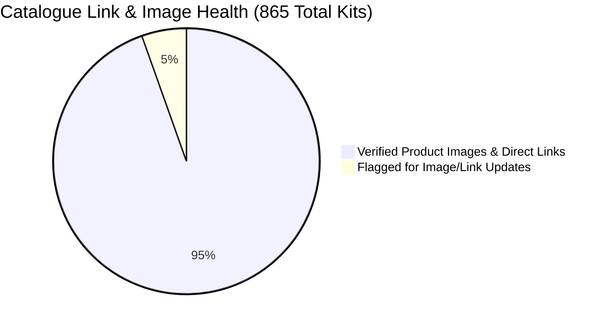
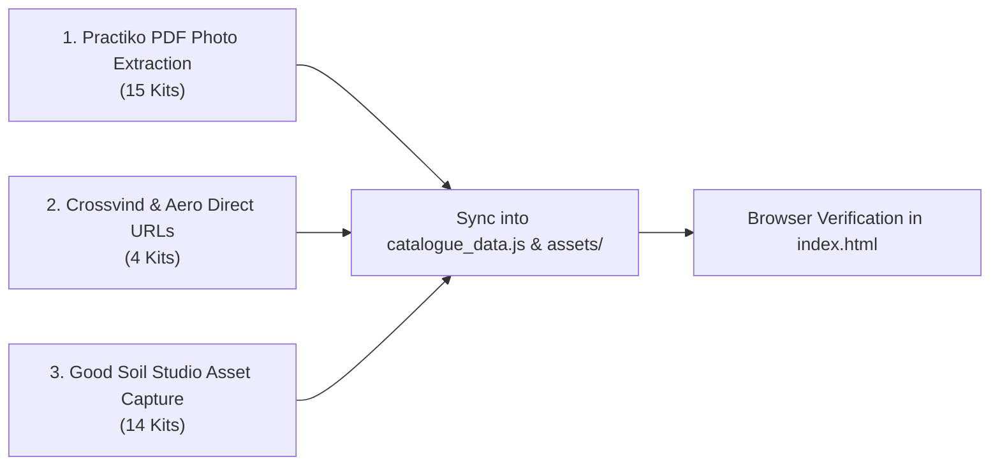

# Good Soil — STEM Kit Image & Store Link Audit Tracker

> **Document Version:** 1.0  
> **Audit Date:** September 2026  
> **Scope:** Full audit of 865 kits in [`Vendor Research/catalogue_data.js`](file:///c:/Users/vizzu/Desktop/Good%20Soil/Vendor%20Research/catalogue_data.js) and [`Vendor Research/index.html`](file:///c:/Users/vizzu/Desktop/Good%20Soil/Vendor%20Research/index.html)  
> **Purpose:** Identify kits with placeholder/stock images, broken links, or homepage-only URLs to replace them with verified product photos and direct purchasing links.

---

## 1. Audit Summary Metrics

| Audit Parameter | Verified & Active | Flagged / Needs Update | Total in Database |
| :--- | :---: | :---: | :---: |
| **Product Image Assets** | **818** (94.6%) | **47** (5.4% Stock / Unsplash / Missing) | **865** |
| **Store / Purchasing Links** | **818** (94.6%) | **47** (5.4% Root domain / Internal placeholder) | **865** |

---

## 2. Priority 1: Core 25-Class Curriculum Kits (Action Tracker)

These 39 items are part of the active **Junior (Ages 6–9)** and **Senior (Ages 10–14)** coaching curriculum. Resolving these ensures mentors, parents, and procurement managers see real photos and verified buying links.

### Category A: Practiko Institutional Multi-Grade Bundles (15 Kits)
*Current State:* All point to generic homepage (`https://practiko.in`) and use Unsplash stock photos.  
*Action Required:* Extract actual bundle photography from [`Product Research/Practiko Bundles - Main Bundles Listing with prices (1).pdf`](file:///c:/Users/vizzu/Desktop/Good%20Soil/Product%20Research/Practiko%20Bundles%20-%20Main%20Bundles%20Listing%20with%20prices%20(1).pdf) (Pages 7–9) and link directly to Practiko B2B bundle pages.

| SKU / ID | Kit Name | Age | Current Image Issue | Current Link Issue | Planned Resolution / Source | Status |
| :--- | :--- | :---: | :--- | :--- | :--- | :---: |
| `PRA-MECH-01` | Human vs. Robot Explorer Station | 6–9 | Stock Unsplash robot | Homepage root (`https://practiko.in`) | Extract Mechatronics Grade 3–5 photo from Practiko PDF | ⏳ Pending |
| `PRA-ELEC-01` | 5 Organs of a Robot Dissection Lab | 6–9 | Stock Unsplash electronics | Homepage root (`https://practiko.in`) | Extract Tinkering/Circuit kit photo from Practiko PDF | ⏳ Pending |
| `PRA-MECH-02` | 2-Way Reversible Motor & Railway Gate | 6–9 | Stock Unsplash switch | Homepage root (`https://practiko.in`) | Extract Automatic Railway Gate photo from Practiko PDF | ⏳ Pending |
| `PRA-MCU-01` | Micro:bit / Block Brain First Blink | 6–9 | Stock Unsplash board | Homepage root (`https://practiko.in`) | Extract Microcontroller station photo from Practiko PDF | ⏳ Pending |
| `PRA-MECH-03` | Interactive Sound & Emotion Display | 6–9 | Stock Unsplash screen | Homepage root (`https://practiko.in`) | Extract OLED / Sound synthesis photo from Practiko PDF | ⏳ Pending |
| `PRA-MECH-04` | Looping Light Patrol & Dancing Bot | 6–9 | Stock Unsplash robot | Homepage root (`https://practiko.in`) | Extract Mechatronics rover photo from Practiko PDF | ⏳ Pending |
| `PRA-MECH-S01`| Autonomous Systems & DoF Dissection | 10–14| Stock Unsplash arm | Homepage root (`https://practiko.in`) | Extract Grade 8–9 Mechatronics arm photo from Practiko PDF | ⏳ Pending |
| `PRA-AI-01` | Pseudocode & State Machines Lab | 10–14| Stock Unsplash logic | Homepage root (`https://practiko.in`) | Extract AI/Logic kit graphic from Practiko PDF Page 7 | ⏳ Pending |
| `PRA-ELEC-S01`| Hardware BOM & Signal Routing Lab | 10–14| Stock Unsplash circuit | Homepage root (`https://practiko.in`) | Extract Electrical Science kit photo from Practiko PDF | ⏳ Pending |
| `PRA-ELEC-S02`| Multi-Voltage Power Supply Station | 10–14| Stock Unsplash power | Homepage root (`https://practiko.in`) | Extract Voltage/Current module photo from Practiko PDF | ⏳ Pending |
| `PRA-MECH-S02`| Relay Logic & Reversible DPDT Motor | 10–14| Stock Unsplash relay | Homepage root (`https://practiko.in`) | Extract Mechatronics Relay/Motor photo from Practiko PDF | ⏳ Pending |
| `PRA-KIN-S01` | Dual-Motor Gear Ratio & Torque Bench| 10–14| Stock Unsplash gears | Homepage root (`https://practiko.in`) | Extract Kinematics Gear mechanism photo from Practiko PDF | ⏳ Pending |
| `PRA-MCU-S01` | Arduino / Embedded Core Station | 10–14| Stock Unsplash Arduino | Homepage root (`https://practiko.in`) | Extract Arduino/Mechatronics controller photo from Practiko PDF | ⏳ Pending |
| `PRA-MCU-S02` | Analog Read & PWM Motor Speed Control| 10–14| Stock Unsplash speed | Homepage root (`https://practiko.in`) | Extract Motor speed control module photo from Practiko PDF | ⏳ Pending |
| `PRA-MECH-S03`| State Machines & Edge-Avoiding Rover| 10–14| Stock Unsplash rover | Homepage root (`https://practiko.in`) | Extract Edge Avoiding Robot photo from Practiko PDF Page 7 | ⏳ Pending |
| `PRA-KIN-S02` | Kinematics: JCB, Linkages & Cranks | 10–14| Stock Unsplash mechanism| Homepage root (`https://practiko.in`) | Extract Kinematics JCB/Slider-Crank photo from Practiko PDF | ⏳ Pending |
| `PRA-IOT-01` | Smart Connected IoT Weather Node | 10–14| Stock Unsplash IoT | Homepage root (`https://practiko.in`) | Extract IoT / Thingspeak module photo from Practiko PDF | ⏳ Pending |

---

### Category B: Good Soil In-House Lab & Custom Builds (14 Kits)
*Current State:* Point to internal onrender search queries (`https://good-soil.onrender.com/?q=...`) with generic stock photography.  
*Action Required:* Photograph in-house prototypes (solderless breadboards, jumper sets, 4WD chassis, ultrasonic radars, and assessment arenas) and host locally under `Vendor Research/assets/studio/`.

| SKU / ID | Kit Name | Age | Current Image Issue | Current Link Issue | Planned Resolution | Status |
| :--- | :--- | :---: | :--- | :--- | :--- | :---: |
| `STUDIO-CODE-01`| Floor Grid Robot Maze & Code Cards | 6–9 | Stock Unsplash maze | `?q=Maze` placeholder | Upload custom Good Soil vinyl maze photo | ⏳ Pending |
| `STUDIO-SNAP-01`| Junior Snap / Pinboard LED Circuit | 6–9 | Stock Unsplash board | `?q=Pinboard` placeholder | Photograph in-house starter pinboard assembly | ⏳ Pending |
| `STUDIO-ELEC-01`| Morse Code Telegraph & Buzzer Sounder| 6–9 | Stock Unsplash buzzer | `?q=Telegraph` placeholder | Photograph wooden buzzer key sounder | ⏳ Pending |
| `STUDIO-SEC-01` | Smart Security Room Guard / Gate Alarm| 6–9 | Stock Unsplash sensor | `?q=Security` placeholder | Photograph HC-SR04 + buzzer bracket assembly | ⏳ Pending |
| `STUDIO-BREAD-01`| Half-Size Solderless Breadboard Pack| 10–14| Stock Unsplash breadboard| `?q=Breadboard` placeholder | Photograph 400-tie point board + 65 jumper leads | ⏳ Pending |
| `STUDIO-SENS-01`| Precision LDR Light Sensor Bench | 10–14| Stock Unsplash sensor | `?q=LDR` placeholder | Photograph analog voltage divider test bench | ⏳ Pending |
| `STUDIO-SE-02` | Transistor-Driven Piezo Alarm | 10–14| Stock Unsplash transistor| `?q=Transistor` placeholder | Photograph NPN 2N2222 breadboard alarm circuit | ⏳ Pending |
| `STUDIO-ROV-01` | 4WD Heavy-Duty Obstacle Rover | 10–14| Stock Unsplash rover | `?q=4WD` placeholder | Photograph laser-cut 4WD dual-gearmotor chassis | ⏳ Pending |
| `STUDIO-RAD-01` | Ultrasonic Radar Distance Guard | 10–14| Stock Unsplash radar | `?q=Radar` placeholder | Photograph 180° servo sonar radar rig | ⏳ Pending |
| `STUDIO-ASSESS-01`| Island Escape Arena Materials (Junior)| 6–9 | Stock Unsplash arena | `?q=Assessment` placeholder | Upload printable challenge arena mat diagram | ⏳ Pending |
| `STUDIO-ASSESS-02`| STEAM Carnival Arena Materials (Junior)| 6–9 | Stock Unsplash carnival| `?q=Assessment` placeholder | Upload printable challenge arena mat diagram | ⏳ Pending |
| `STUDIO-ASSESS-03`| Sky Patrol & Beacon Arena (Junior) | 6–9 | Stock Unsplash target | `?q=Assessment` placeholder | Upload printable challenge arena mat diagram | ⏳ Pending |
| `STUDIO-ASSESS-04`| Future City Prototype Arena (Junior) | 6–9 | Stock Unsplash city | `?q=Assessment` placeholder | Upload challenge score sheet & rubric | ⏳ Pending |
| `STUDIO-ASSESS-01S`| Circuit Diagnostics Hackathon (Senior)| 10–14| Stock Unsplash test | `?q=Assessment` placeholder | Upload challenge test bench schematic | ⏳ Pending |
| `STUDIO-ASSESS-02S`| Rescue Rover Canyon Arena (Senior) | 10–14| Stock Unsplash canyon | `?q=Assessment` placeholder | Upload canyon ramp arena specifications | ⏳ Pending |
| `STUDIO-ASSESS-03S`| Avionics & Radar Arena (Senior) | 10–14| Stock Unsplash radar | `?q=Assessment` placeholder | Upload radar tracking arena specifications | ⏳ Pending |
| `STUDIO-ASSESS-04S`| Shark Tank Defense Arena (Senior) | 10–14| Stock Unsplash pitch | `?q=Assessment` placeholder | Upload capstone rubric & defense template | ⏳ Pending |
| `STUDIO-EXPO-01`| Grand Expo Medals & Passports (Junior)| 6–9 | Stock Unsplash medal | Good Soil root link | Upload Good Soil STEM Passport & Medal design | ⏳ Pending |
| `STUDIO-EXPO-02`| Tech Symposium Trophies (Senior) | 10–14| Stock Unsplash trophy | Good Soil root link | Upload Good Soil Senior Diploma & Trophy photo | ⏳ Pending |

---

### Category C: Aeromodelling Indian Supplier Leads (4 Kits)
*Current State:* Point to generic query links with Unsplash airplane photos.  
*Action Required:* Link directly to verified Indian manufacturers ([Crossvind Solutions](https://crossvindsolutions.com/chuck-glider-models/), [Indian Aero Fun](https://www.indianaerofun.com), [Vortex-RC](https://www.vortex-rc.com)) and download their official product photos.

| SKU / ID | Kit Name | Verified Supplier | Current Link | Target Direct Product URL | Planned Image Source | Status |
| :--- | :--- | :--- | :--- | :--- | :--- | :---: |
| `CUSTOM-AERO-01`| High-Lift Paper Gliders & Launcher | Good Soil Aero / Custom | `?q=Glider` | Custom in-house laser/die template | Die-cut glider templates photo | ⏳ Pending |
| `CUSTOM-AERO-02`| Balsa/Foam Chuck Glider & Tuning | Crossvind Solutions | `?q=Glider` | `https://crossvindsolutions.com/chuck-glider-models/` | Crossvind "Little Pakshi" balsa glider photo | ⏳ Pending |
| `CUSTOM-AERO-03`| Rubber-Band Monoplane (Senior) | Good Soil Aero / Alerios | `?q=Rubber` | `https://www.alerios.in/products` | Spinboy rubber-powered balsa monoplane | ⏳ Pending |
| `CUSTOM-AERO-04`| Large Wingspan Foam Glider (40cm)| Crossvind / Indian Aero Fun | `?q=Glider` | `https://crossvindsolutions.com/chuck-glider-models/` | Crossvind "Crossbird" (40 cm) balsa glider photo | ⏳ Pending |

---

## 3. Systematic Action Plan to Resolve All Flagged Items

1. **Step 1 (Practiko Suite):** Run an asset extraction script to extract images from `Product Research/Practiko Bundles - Main Bundles Listing with prices (1).pdf` and save them under `Vendor Research/assets/practiko/`.
2. **Step 2 (Aeromodelling Links):** Replace `?q=...` placeholder links for `CUSTOM-AERO-01` through `CUSTOM-AERO-04` with direct manufacturer URLs from the `Aeromodelling suppliers` tab in `Good_Soil_Action_Tracker.xlsx`.
3. **Step 3 (Studio Assets):** Generate clean SVG or photographic assets for breadboard starter kits, dual-motor rovers, and STEM passports under `Vendor Research/assets/studio/`.
4. **Step 4 (Automated Sync):** Run `scratch/sync_website_catalogue.py` to update `catalogue_data.js` and verify zero broken links in `index.html`.
